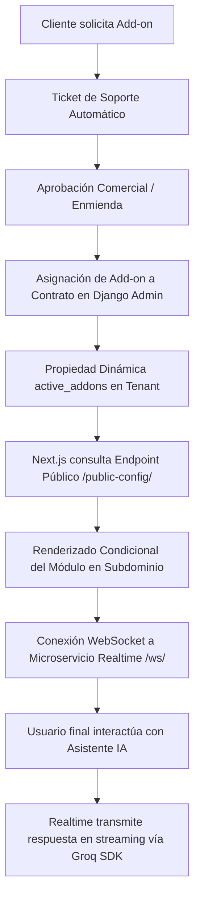

# Manual Operativo y Logística de Add-ons — Néctar Labs

Este documento detalla el flujo logístico y operativo completo para la adquisición, activación, facturación, aprovisionamiento técnico y mantenimiento de Add-ons (módulos adicionales) para los subdominios de clientes de **Néctar Labs**.

---

## Arquitectura de Activación Dinámica

Para evitar el acoplamiento y asegurar un desarrollo artesanal premium, los Add-ons no se habilitan mediante código estático. En su lugar, el sistema funciona como un motor de **Feature Flags** gobernado por el estado de los contratos comerciales del cliente:



---

## Fase 1: Descubrimiento y Solicitud

1. **Catálogo de Add-ons (Dashboard)**:
   - El cliente ingresa a su Dashboard principal y navega a la sección **Add-ons**.
   - Al ver un módulo de interés (por ejemplo, **Live Chat**), el cliente hace clic en el botón **Solicitar Activación**.
2. **Generación Automática del Ticket**:
   - El frontend genera una petición al backend para abrir un ticket de soporte con los siguientes parámetros técnicos predefinidos:
     - **Título**: `[Solicitud de Add-on] Habilitar <Nombre del Add-on>`
     - **Categoría**: `IMPLEMENTATION`
     - **Prioridad**: `HIGH`
     - **Descripción**: *"El cliente solicita la cotización y activación del Add-on '<Nombre>' para su subdominio '<subdominio>'."*
3. **Notificación al Equipo**:
   - El sistema de tickets alerta automáticamente al equipo de soporte de Néctar Labs.

---

## Fase 2: Conciliación Comercial y Facturación

Cuando un cliente adquiere un add-on, la relación contractual y el plan de pagos mensual se rigen por la siguiente política comercial:

### 1. Políticas Comerciales y Reglas de Negocio

> [!TIP]
> **Esquemas de Acceso a Add-ons**:
> 1. **Clientes con Contrato de Desarrollo de 6 Meses Activo (Con Plan)**: 
>    * Cuentan con **acceso total y gratuito ($0 MXN)** a todos los Add-ons activos en el ecosistema.
>    * El servicio técnico de instalación, configuración y soporte de estos Add-ons está completamente integrado. Las horas dedicadas se deducen del saldo de horas mensuales del plan contratado.
>    * En el Dashboard de cliente, las tarifas regulares se muestran tachadas y los módulos se habilitan solicitándolos sin costo adicional.
> 2. **Clientes sin Plan de Desarrollo de 6 Meses**:
>    * Adquieren los Add-ons de forma manual e individual a las tarifas estándar vigentes (mensuales o anuales).
>    * El costo consolidado de los Add-ons activos y asignados a su contrato se carga de manera íntegra a sus mensualidades.
> 3. **Contratos Flexibles (Add-ons Only)**:
>    * Para clientes que deseen adquirir módulos y Add-ons de Néctar Labs de manera independiente sin un plan de desarrollo asociado, el campo `plan` en el modelo `Contract` es opcional (`null=True`).
>    * In this scheme, the monthly payment is calculated by summing the prices of the active addons.

### 2. Enmienda de Contrato (Contract Amendment)
* **Asociación en base de datos**: Para clientes que compran Add-ons de forma manual o que tienen contratos personalizados, el administrador asocia los Add-ons en el listado multiselección de `addons` del contrato del cliente (`Contract`) a través del Django Admin.
* **Activación automática**: Si el cliente tiene un plan de desarrollo activo, el backend le otorga acceso automático a todo el catálogo sin necesidad de vinculación individual en el Django Admin, pero se pueden asociar manualmente para propósitos de registro e inventario.

### 3. Regla de Prorrateo del Ciclo Actual (Solo para Adquisición con Costo)
Si el Add-on se adquiere de manera individual y con costo a mitad del mes de facturación en curso, se debe cobrar una fracción correspondiente a los días restantes hasta el próximo corte:
* **Plan Base**: \$3,000 MXN/mes.
* **Add-on Adquirido**: Live Chat (\$500 MXN/mes).
* **Situación**: El cliente va en el mes 2 de su contrato de 6 meses. La mensualidad 2 ya está pagada. Quedan 10 días para el corte del mes.
* **Cálculo de Prorrateo**:
  $$\text{Prorrateo} = \left(\frac{10}{30}\right) \times 500 = \$166.67\text{ MXN}$$
* **Ajuste de Mensualidades**:
  * **Mensualidad 3**: Se ajusta a $\$3,000\text{ (Base)} + \$500\text{ (Add-on)} + \$166.67\text{ (Prorrateo)} = \$3,666.67\text{ MXN}$.
  * **Mensualidades 4, 5 y 6**: Se reajustan a $\$3,000\text{ (Base)} + \$500\text{ (Add-on)} = \$3,500.00\text{ MXN}$ cada una.

---

## Fase 3: Aprovisionamiento Técnico e Integración

### 1. Habilitación Dinámica de Rutas e Interfaces (Feature Flags)
El backend expone de manera segura los Add-ons activos en la serialización pública del Tenant (`TenantPublicSerializer`):
```json
{
  "id": "e4f8d22c-...",
  "name": "Cliente Ejemplo",
  "subdomain": "ejemplo",
  "theme_color": "#C68A1E",
  "active_addons": ["live-chat"]
}
```
El componente del frontend de Next.js verifica si el slug requerido se encuentra en `active_addons`:
* **Si está presente**: Renderiza dinámicamente el componente interactivo de Chat de Soporte conectado al microservicio de WebSockets (`wss://[domain]/ws/`).
* **Si no está presente**: Renderiza un **Placeholder Premium** branded que invita a adquirir el módulo.

### 2. Variables de Entorno y Microservicios
El Add-on de **Live Chat** requiere la inicialización del microservicio `realtime` y el servidor de caché `redis`.

1. **Variables para el Microservicio `realtime`** (se configuran en `.env.staging` / `.env`):
   ```env
   # API Key de Groq para streaming de respuestas de la IA de asistencia
   GROQ_API_KEY=gsk_...
   
   # Conexión a Base de Datos (PostgreSQL) para verificar accesos y persistir chats
   DATABASE_URL=postgresql://postgres:password@db:5432/nectarlabs
   
   # Puerto interno del WebSocket
   PORT=4000
   ```

2. **Variables para el Caché de Django con Redis**:
   ```env
   # URL de conexión a la base de datos Redis del entorno correspondiente
   REDIS_URL=redis://redis:6379/1
   ```

3. Reinicie los contenedores para aplicar las nuevas configuraciones y arrancar el WebSocket:
   ```bash
   ./nectar.sh restart-staging
   ```

### 3. DNS y Configuración del Servidor Inbound
Los subdominios de inquilinos se resuelven de manera dinámica en Nginx mediante expresiones regulares o comodines:
* **Certificado SSL**: Asegurar que Let's Encrypt o el proveedor de certificados soporte subdominios comodín (`*.nectarlabs.dev` en staging o tu dominio de producción).
* **DNS Wildcard**: Debe existir un registro DNS tipo **CNAME** con host `*` apuntando a la IP pública del balanceador de carga o proxy.

---

## Fase 4: Mantenimiento y Baja (Offboarding)

### 1. Monitoreo del Add-on (APM Metrics)
* Verifique el impacto en la base de datos y la memoria caché mediante el módulo APM en el Dashboard de Administración de Néctar Labs.
* Monitoree las conexiones WebSocket activas si el módulo de Live Chat experimenta un alto volumen de mensajes concurrentes.

### 2. Desinstalación Limpia (Offboarding)
Si el cliente solicita dar de baja un Add-on o finaliza su contrato de 6 meses sin renovación:

1. **Desactivación en Django Admin**: Retire el `AddOn` del listado de `addons` del contrato del cliente.
2. **Reflejo Inmediato**: La API del subdominio actualizará el listado y el frontend volverá a mostrar el Placeholder Premium de manera automática en tiempo real.
3. **Limpieza en Base de Datos y Caché**:
   - Purgue las claves de caché de Redis asociadas al tenant para liberar memoria:
     ```bash
     # Ejemplo de comando para limpiar caché de Live Chat en Staging
     docker compose -f docker-compose.staging.yml exec backend-staging python manage.py shell -c "from django.core.cache import cache; cache.delete_pattern('livechat:ejemplo:*')"
     ```
   - Elimine de manera segura los esquemas de datos o tablas temporales del cliente para mantener la infraestructura ligera y ordenada.

---

## Guía Operativa de Uso para cada Add-on

A continuación se detalla el manual de usuario (Tenant) y de administración (Néctar Labs Admin) para cada uno de los 9 Add-ons del ecosistema.

---

### 1. Néctar Live Chat Bot (Slug: `live-chat`)
* **Categoría**: COMUNICACIÓN EN VIVO
* **Complejidad**: Media (Servicio en tiempo real)
* **Requisitos Técnicos**: Django Channels (ASGI) + Redis para WebSocket State + Groq AI SDK.

#### Funciones Disponibles Actualmente
* Widget flotante de chat incrustable e interactivo para los usuarios finales.
* Generación de respuestas inteligentes en tiempo real (streaming token-por-token) mediante IA de Groq.
* Consola multi-agente para interactuar en vivo con clientes finales.
* Historial persistente de conversaciones en base de datos.
* Marcado y control de estado de tickets de chat (Abierto / Resuelto / Cerrado).

#### Instrucciones de Uso para el Tenant (Dueño de la Colmena)
1. **Acceso**: Entra a tu portal de administración en `https://<tu-subdominio>.nectarlabs.dev/portal-admin` y navega a **Mensajes en Vivo / Chats**.
2. **Configuración de IA**: En la pestaña de configuración, escribe el prompt que definirá el comportamiento y personalidad del bot de soporte (por ejemplo: *"Eres un asistente servicial para una pizzería..."*).
3. **Gestión de Chats**:
   * En la consola verás la lista de chats activos iniciados por usuarios en la web.
   * Haz clic en cualquier conversación activa para leer el historial.
   * **Tomar Control**: Escribe en la barra inferior y envía un mensaje. La IA se suspenderá automáticamente para que continúes de manera manual.
   * **Resolver/Cerrar**: Haz clic en "Marcar como Resuelto" cuando la consulta del cliente termine.

#### Instrucciones de Uso para el Admin (Néctar Labs)
1. **Asociación**: Entra al Django Admin global (`/admin`), navega a **Contracts**, edita el contrato del tenant y marca el checkbox `live-chat` en el listado de Add-ons.
2. **Aprovisionamiento**: Asegúrate de que las variables `GROQ_API_KEY`, `REDIS_URL` y el microservicio `realtime` en Node.js estén corriendo correctamente en el servidor.
3. **Soporte Técnico**: En caso de problemas con la conexión en tiempo real, verifica el estado de las conexiones WebSocket analizando los logs de Docker: `docker compose logs realtime`.

---

### 2. Néctar Contratos Digitales (Slug: `booking-signature`)
* **Categoría**: CONTRATOS DIGITALES
* **Complejidad**: Alta (Generación criptográfica y de documentos)
* **Requisitos Técnicos**: ReportLab en Backend + Canvas HTML5 en Frontend + Almacenamiento seguro en la nube (S3/Cloudinary).

#### Funciones Disponibles Actualmente
* Editor de plantillas de contratos comerciales.
* Firmador digital interactivo con soporte táctil o con cursor.
* Generación automática de documentos PDF validados criptográficamente.
* Envío automatizado de propuestas comerciales con plantillas HTML personalizadas.

#### Instrucciones de Uso para el Tenant (Dueño de la Colmena)
1. **Acceso**: Entra a tu `/portal-admin` y navega a **Contratos**.
2. **Crear Propuesta**: Haz clic en **Nueva Propuesta**, define el nombre del cliente, el plan a cotizar y los términos adicionales.
3. **Enviar Link**: Comparte el enlace seguro autogenerado con el cliente final.
4. **Validación**: Una vez firmado por el cliente, podrás ver la firma plasmada en el PDF y el estatus cambiará a `Signed`. Podrás descargar el documento PDF certificado en cualquier momento.

#### Instrucciones de Uso para el Admin (Néctar Labs)
1. **Creación de Contratos**: El Administrador es quien aprueba la cotización de proyectos o addons. Al marcar un contrato como `APPROVED`, se genera el link público para la pantalla de firmas del cliente `/contract/sign/[id]`.
2. **Firma Desarrollador**: Como representante de Néctar Labs, debes ingresar a `/contract/dev-sign/[id]` y plasmar tu firma de validación técnica para activar el aprovisionamiento.

---

### 3. Tienda + Envíos con Skydropx (Slug: `logistics-gps`)
* **Categoría**: LOGÍSTICA Y CONTROL
* **Complejidad**: Muy Alta (Integración externa multitarifa)
* **Requisitos Técnicos**: API de Skydropx + Modelos de Órdenes y Checkout en frontend.

#### Funciones Disponibles Actualmente
* Cotización automatizada de costos de envío a nivel nacional durante el checkout.
* Regla de margen de ganancia (Markup) personalizable del 15% sobre las tarifas de paqueterías base.
* Generación automatizada de etiquetas de envío (guías de FedEx, DHL, Estafeta) al marcar el pedido como pagado.
* Envío de enlaces de rastreo al cliente final de manera inmediata.

#### Instrucciones de Uso para el Tenant (Dueño de la Colmena)
1. **Configuración de Origen**: Entra a tu `/portal-admin` y navega a **Configuración > Envíos**. Registra la dirección fiscal y código postal del almacén de donde se enviarán las mercancías.
2. **API Keys**: Introduce tus credenciales (Token) de Skydropx (desarrollo o producción).
3. **Procesamiento de Órdenes**:
   * En la sección de **Ventas/Pedidos**, haz clic en una orden confirmada como pagada.
   * Haz clic en **Generar Guía de Envío**. El sistema contactará a Skydropx y descargará la etiqueta en PDF.
   * Imprime la guía, pégala en el paquete y entrégala a la paquetería correspondiente.

#### Instrucciones de Uso para el Admin (Néctar Labs)
1. **Activación**: Habilita el addon `logistics-gps` en el contrato del cliente en Django Admin.
2. **Monitoreo**: Supervisa los logs de conexión con la API de Skydropx para diagnosticar caídas o errores de autenticación con el token del cliente.

---

### 4. Néctar Sponsors & NSCAP (Slug: `patreon-sponsorship`)
* **Categoría**: MONETIZACIÓN
* **Complejidad**: Media (Manejo de Webhooks y Roles)
* **Requisitos Técnicos**: Cuenta comercial de Stripe + Webhooks configurados en backend.

#### Funciones Disponibles Actualmente
* Creación y gestión de niveles de membresías recurrentes (Tiers).
* Bloqueo selectivo de contenido (Textos, PDFs, Videos) en el Blog/Portal.
* Procesamiento de suscripciones recurrentes con reintentos automáticos.
* Portal de auto-gestión del suscriptor para cancelaciones y cambios de tarjeta.

#### Instrucciones de Uso para el Tenant (Dueño de la Colmena)
1. **Acceso**: Entra a tu `/portal-admin` y ve a **Membresías & Tiers**.
2. **Vincular Stripe**: Conecta tu cuenta Stripe a través del flujo guiado.
3. **Creación de Tiers**: Crea tus niveles de patrocinio (por ejemplo: *Bronce $99/mes, Oro $299/mes*).
4. **Proteger Contenido**: Al crear o editar un artículo o sección de contenido multimedia en tu administrador de Blog, selecciona qué niveles mínimos de membresía tienen acceso para visualizar el contenido.

#### Instrucciones de Uso para el Admin (Néctar Labs)
1. **Configuración**: Asegúrate de que el webhook de Stripe (`/api/sponsorship/webhook/`) esté correctamente registrado en el panel de Stripe del cliente para recibir eventos de suscripción (`customer.subscription.created`, `invoice.payment_succeeded`).
2. **Monitoreo**: Verifica los roles del modelo `User` para resolver incidencias de acceso de suscriptores cuyas tarjetas hayan sido rechazadas.

---

### 5. Néctar Ventas y Analytics (Slug: `analytics-apm`)
* **Categoría**: MONETIZACIÓN
* **Complejidad**: Media (Procesamiento analítico)
* **Requisitos Técnicos**: Pandas + Middleware de registro de peticiones de DRF.

#### Funciones Disponibles Actualmente
* Métricas financieras clave (MRR, Ventas Totales, LTV, AOV) en tiempo real.
* Gráficos interactivos de ingresos mensuales e históricos.
* Exportación de datos de transacciones a formatos Excel y CSV.
* Análisis de comportamiento del embudo de ventas.

#### Instrucciones de Uso para el Tenant (Dueño de la Colmena)
1. **Acceso**: Entra a tu `/portal-admin` y ve al **Dashboard de Analítica**.
2. **Consultar Métricas**: Filtra el periodo de tiempo deseado en el calendario superior.
3. **Gráficos**: Pasa el cursor sobre las gráficas de líneas y barras para ver el desglose por día o por producto más vendido.
4. **Exportar**: Haz clic en **Exportar a CSV** para descargar tu reporte financiero para fines contables.

#### Instrucciones de Uso para el Admin (Néctar Labs)
1. **Activación**: Activa el addon `analytics-apm` en el contrato del cliente.
2. **Mantenimiento**: Monitorea el consumo de CPU y memoria del backend cuando se ejecutan consultas agregadas de gran escala mediante Pandas. Asegúrate de que el middleware esté correctamente instalado en `MIDDLEWARE` dentro de `settings.py`.

---

### 6. Néctar Newsletter y Campañas (Slug: `newsletter-campaigner`)
* **Categoría**: EMAIL MARKETING
* **Complejidad**: Baja (Integración de Mailer)
* **Requisitos Técnicos**: SMTP o AWS SES + Tokens UUID de desuscripción seguros.

#### Funciones Disponibles Actualmente
* Base de datos dedicada de suscriptores con importación masiva por archivo.
* Diseñador de boletines informativos basado en plantillas HTML configurables.
* Programador de campañas masivas de correo electrónico.
* Enlace obligatorio y seguro de desuscripción de 1 clic para evitar catalogación como spam.

#### Instrucciones de Uso para el Tenant (Dueño de la Colmena)
1. **Acceso**: En tu `/portal-admin`, navega a **Boletines / Newsletter**.
2. **Base de Contactos**: Registra suscriptores de forma individual o importa una lista de correos.
3. **Crear Campaña**: Redacta el asunto y cuerpo de tu correo, selecciona una de las plantillas premium e inserta imágenes de tus productos.
4. **Enviar**: Programa el envío masivo inmediato o a una hora específica.

#### Instrucciones de Uso para el Admin (Néctar Labs)
1. **Configuración de SMTP/SES**: Configura las credenciales del servidor SMTP en el backend. En producción, se recomienda configurar AWS SES con firmas SPF y DKIM validadas para garantizar que los correos no lleguen a la carpeta de spam.
2. **Control de Límites**: El addon incluye 1,000 envíos mensuales. Supervisa la tabla `NewsletterLog` para facturar envíos excedentes en el próximo corte.

---

### 7. Facturación SAT México (Slug: `mexico-invoicing`)
* **Categoría**: CONTABILIDAD Y FISCAL
* **Complejidad**: Alta (Regulaciones gubernamentales)
* **Requisitos Técnicos**: Facturapi API + Carga de certificados CSD (.cer y .key) con encriptación.

#### Funciones Disponibles Actualmente
* Creación e integración automática de organizaciones subordinadas en Facturapi.
* Carga segura y almacenamiento encriptado de sellos digitales (CSD).
* Generador de facturas oficiales bajo el estándar CFDI 4.0 del SAT.
* Sincronización automática de bases de datos LCO del SAT para validar RFCs.
* Descarga directa del archivo XML de timbrado y la versión imprimible en PDF.

#### Instrucciones de Uso para el Tenant (Dueño de la Colmena)
1. **Configuración Fiscal**: En tu `/portal-admin`, ve a **Facturación SAT > Configurar**.
2. **Subir Sellos**: Carga tus archivos `.cer` y `.key` vigentes de tus sellos CSD y digita la contraseña de los mismos. Rellena tu RFC, Razón Social, Dirección y Régimen Fiscal.
3. **Timbrar Factura**:
   * En la lista de pedidos o abonos, haz clic en **Solicitar Factura**.
   * Llena los datos del cliente (RFC, Uso de CFDI, Régimen del cliente).
   * Haz clic en **Emitir CFDI**. El sistema validará con el SAT e inmediatamente te dará las opciones para descargar el PDF y XML de la factura.

#### Instrucciones de Uso para el Admin (Néctar Labs)
1. **Configuración de Entorno**: Introduce la variable de entorno `FACTURAPI_SECRET_KEY` en el archivo `.env`.
2. **Consumo de Timbres**: El plan incluye 20 timbres mensuales. A través de la tabla `TenantInvoicingQuota`, verifica el conteo de timbres emitidos y administra la recarga de paquetes de timbres extras si el cliente lo solicita.

---

### 8. Facturación Automática SAT (Slug: `automatic-invoicing`)
* **Categoría**: CONTABILIDAD Y FISCAL
* **Complejidad**: Media (Automatización basada en eventos)
* **Requisitos Técnicos**: Módulo de Facturación SAT México (`mexico-invoicing`) activo + Webhook de Checkout/Stripe.

#### Funciones Disponibles Actualmente
* Timbrado 100% desatendido de facturas fiscales al confirmarse la compra de un producto o pago de abono.
* Envío inmediato por correo electrónico de los archivos PDF y XML de la factura al cliente final.
* Sistema inteligente de reintentos asíncronos ante posibles caídas temporales del PAC o del SAT.

#### Instrucciones de Uso para el Tenant (Dueño de la Colmena)
1. **Acceso**: En tu `/portal-admin`, navega a **Facturación > Automatizaciones**.
2. **Activar**: Cambia el interruptor de "Timbrado Automático" a **Activo**.
3. **Configuración**: Elige si deseas que se emita la factura inmediatamente al confirmarse el pago por Stripe, o bien cuando apruebes manualmente un comprobante de transferencia bancaria SPEI.
4. **Verificación**: Asegúrate de que todos tus productos tengan asignada la clave de producto/servicio del SAT correcta en tu catálogo de productos para evitar errores de timbrado automático.

#### Instrucciones de Uso para el Admin (Néctar Labs)
1. **Dependencia**: Recuerda que este Add-on requiere obligatoriamente tener configurado y activo el addon **Facturación SAT México (`mexico-invoicing`)**. No se puede aprovisionar de forma aislada.

---

### 9. Combo E-commerce Automatizado (Slug: `ecommerce-combo`)
* **Categoría**: E-COMMERCE COMBO
* **Complejidad**: Alta (Suite integrada)
* **Requisitos Técnicos**: Activación conjunta de `logistics-gps` + `mexico-invoicing` + `newsletter-campaigner`.

#### Funciones Disponibles Actualmente
* Acceso completo y sin restricciones a todos los beneficios de la Suite E-commerce de Néctar Labs.
* Sincronización cruzada: cuando una orden es pagada en la tienda, se cotiza el envío de inmediato, se genera la guía de paquetería y se timbra la factura SAT en un solo proceso de fondo.

#### Instrucciones de Uso para el Tenant (Dueño de la Colmena)
1. **Configuración**: Sigue los pasos de configuración individual de los Add-ons de Skydropx, Facturación SAT y Newsletter en la pestaña unificada de **Suite Config** de tu `/portal-admin`. Todo el panel se organiza en pestañas simplificadas para evitar configurar múltiples secciones por separado.

#### Instrucciones de Uso para el Admin (Néctar Labs)
1. **Descuento de Facturación**: Al habilitar este combo, el sistema aplica de forma automática la tarifa unificada con descuento ($799.00 MXN en lugar de adquirir los módulos de forma individual), la cual se consolida en la mensualidad recurrente del cliente final.

---

*Desarrollado con el profesionalismo y el estándar de software artesanal de Néctar Labs.*

