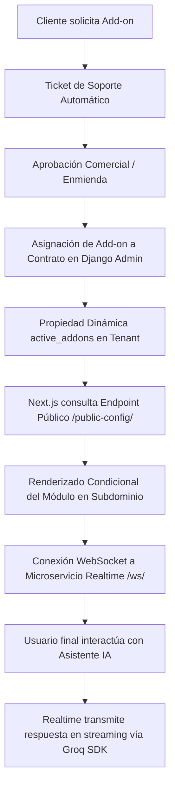

# Manual Operativo y Logística de Add-ons — Néctar Labs

Este documento detalla el flujo logístico y operativo completo para la adquisición, activación, facturación, aprovisionamiento técnico y mantenimiento de Add-ons (módulos adicionales) para los subdominios de clientes de **Néctar Labs**.

---

## Arquitectura de Activación Dinámica

Para evitar el acoplamiento y asegurar un desarrollo artesanal premium, los Add-ons no se habilitan mediante código estático. En su lugar, el sistema funciona como un motor de **Feature Flags** gobernado por el estado de los contratos comerciales del cliente:



---

## Fase 1: Descubrimiento y Solicitud

1. **Catálogo de Add-ons (Dashboard)**:
   - El cliente ingresa a su Dashboard principal y navega a la sección **Add-ons**.
   - Al ver un módulo de interés (por ejemplo, **Live Chat**), el cliente hace clic en el botón **Solicitar Activación**.
2. **Generación Automática del Ticket**:
   - El frontend genera una petición al backend para abrir un ticket de soporte con los siguientes parámetros técnicos predefinidos:
     - **Título**: `[Solicitud de Add-on] Habilitar <Nombre del Add-on>`
     - **Categoría**: `IMPLEMENTATION`
     - **Prioridad**: `HIGH`
     - **Descripción**: *"El cliente solicita la cotización y activación del Add-on '<Nombre>' para su subdominio '<subdominio>'."*
3. **Notificación al Equipo**:
   - El sistema de tickets alerta automáticamente al equipo de soporte de Néctar Labs.

---

## Fase 2: Conciliación Comercial y Facturación

Cuando un cliente adquiere un add-on, la relación contractual y el plan de pagos mensual se rigen por la siguiente política comercial:

### 1. Políticas Comerciales y Reglas de Negocio

> [!TIP]
> **Esquemas de Acceso a Add-ons**:
> 1. **Clientes con Contrato de Desarrollo de 6 Meses Activo (Con Plan)**: 
>    * Cuentan con **acceso total y gratuito ($0 MXN)** a todos los Add-ons activos en el ecosistema.
>    * El servicio técnico de instalación, configuración y soporte de estos Add-ons está completamente integrado. Las horas dedicadas se deducen del saldo de horas mensuales del plan contratado.
>    * En el Dashboard de cliente, las tarifas regulares se muestran tachadas y los módulos se habilitan solicitándolos sin costo adicional.
> 2. **Clientes sin Plan de Desarrollo de 6 Meses**:
>    * Adquieren los Add-ons de forma manual e individual a las tarifas estándar vigentes (mensuales o anuales).
>    * El costo consolidado de los Add-ons activos y asignados a su contrato se carga de manera íntegra a sus mensualidades.
> 3. **Contratos Flexibles (Add-ons Only)**:
>    * Para clientes que deseen adquirir módulos y Add-ons de Néctar Labs de manera independiente sin un plan de desarrollo asociado, el campo `plan` en el modelo `Contract` es opcional (`null=True`).
>    * In this scheme, the monthly payment is calculated by summing the prices of the active addons.

### 2. Enmienda de Contrato (Contract Amendment)
* **Asociación en base de datos**: Para clientes que compran Add-ons de forma manual o que tienen contratos personalizados, el administrador asocia los Add-ons en el listado multiselección de `addons` del contrato del cliente (`Contract`) a través del Django Admin.
* **Activación automática**: Si el cliente tiene un plan de desarrollo activo, el backend le otorga acceso automático a todo el catálogo sin necesidad de vinculación individual en el Django Admin, pero se pueden asociar manualmente para propósitos de registro e inventario.

### 3. Regla de Prorrateo del Ciclo Actual (Solo para Adquisición con Costo)
Si el Add-on se adquiere de manera individual y con costo a mitad del mes de facturación en curso, se debe cobrar una fracción correspondiente a los días restantes hasta el próximo corte:
* **Plan Base**: \$3,000 MXN/mes.
* **Add-on Adquirido**: Live Chat (\$500 MXN/mes).
* **Situación**: El cliente va en el mes 2 de su contrato de 6 meses. La mensualidad 2 ya está pagada. Quedan 10 días para el corte del mes.
* **Cálculo de Prorrateo**:
  $$\text{Prorrateo} = \left(\frac{10}{30}\right) \times 500 = \$166.67\text{ MXN}$$
* **Ajuste de Mensualidades**:
  * **Mensualidad 3**: Se ajusta a $\$3,000\text{ (Base)} + \$500\text{ (Add-on)} + \$166.67\text{ (Prorrateo)} = \$3,666.67\text{ MXN}$.
  * **Mensualidades 4, 5 y 6**: Se reajustan a $\$3,000\text{ (Base)} + \$500\text{ (Add-on)} = \$3,500.00\text{ MXN}$ cada una.

---

## Fase 3: Aprovisionamiento Técnico e Integración

### 1. Habilitación Dinámica de Rutas e Interfaces (Feature Flags)
El backend expone de manera segura los Add-ons activos en la serialización pública del Tenant (`TenantPublicSerializer`):
```json
{
  "id": "e4f8d22c-...",
  "name": "Cliente Ejemplo",
  "subdomain": "ejemplo",
  "theme_color": "#C68A1E",
  "active_addons": ["live-chat"]
}
```
El componente del frontend de Next.js verifica si el slug requerido se encuentra en `active_addons`:
* **Si está presente**: Renderiza dinámicamente el componente interactivo de Chat de Soporte conectado al microservicio de WebSockets (`wss://[domain]/ws/`).
* **Si no está presente**: Renderiza un **Placeholder Premium** branded que invita a adquirir el módulo.

### 2. Variables de Entorno y Microservicios
El Add-on de **Live Chat** requiere la inicialización del microservicio `realtime` y el servidor de caché `redis`.

1. **Variables para el Microservicio `realtime`** (se configuran en `.env.staging` / `.env`):
   ```env
   # API Key de Groq para streaming de respuestas de la IA de asistencia
   GROQ_API_KEY=gsk_...
   
   # Conexión a Base de Datos (PostgreSQL) para verificar accesos y persistir chats
   DATABASE_URL=postgresql://postgres:password@db:5432/nectarlabs
   
   # Puerto interno del WebSocket
   PORT=4000
   ```

2. **Variables para el Caché de Django con Redis**:
   ```env
   # URL de conexión a la base de datos Redis del entorno correspondiente
   REDIS_URL=redis://redis:6379/1
   ```

3. Reinicie los contenedores para aplicar las nuevas configuraciones y arrancar el WebSocket:
   ```bash
   ./nectar.sh restart-staging
   ```

### 3. DNS y Configuración del Servidor Inbound
Los subdominios de inquilinos se resuelven de manera dinámica en Nginx mediante expresiones regulares o comodines:
* **Certificado SSL**: Asegurar que Let's Encrypt o el proveedor de certificados soporte subdominios comodín (`*.nectarlabs.dev` en staging o tu dominio de producción).
* **DNS Wildcard**: Debe existir un registro DNS tipo **CNAME** con host `*` apuntando a la IP pública del balanceador de carga o proxy.

---

## Fase 4: Mantenimiento y Baja (Offboarding)

### 1. Monitoreo del Add-on (APM Metrics)
* Verifique el impacto en la base de datos y la memoria caché mediante el módulo APM en el Dashboard de Administración de Néctar Labs.
* Monitoree las conexiones WebSocket activas si el módulo de Live Chat experimenta un alto volumen de mensajes concurrentes.

### 2. Desinstalación Limpia (Offboarding)
Si el cliente solicita dar de baja un Add-on o finaliza su contrato de 6 meses sin renovación:

1. **Desactivación en Django Admin**: Retire el `AddOn` del listado de `addons` del contrato del cliente.
2. **Reflejo Inmediato**: La API del subdominio actualizará el listado y el frontend volverá a mostrar el Placeholder Premium de manera automática en tiempo real.
3. **Limpieza en Base de Datos y Caché**:
   - Purgue las claves de caché de Redis asociadas al tenant para liberar memoria:
     ```bash
     # Ejemplo de comando para limpiar caché de Live Chat en Staging
     docker compose -f docker-compose.staging.yml exec backend-staging python manage.py shell -c "from django.core.cache import cache; cache.delete_pattern('livechat:ejemplo:*')"
     ```
   - Elimine de manera segura los esquemas de datos o tablas temporales del cliente para mantener la infraestructura ligera y ordenada.

---

*Desarrollado con el profesionalismo y el estándar de software artesanal de Néctar Labs.*
