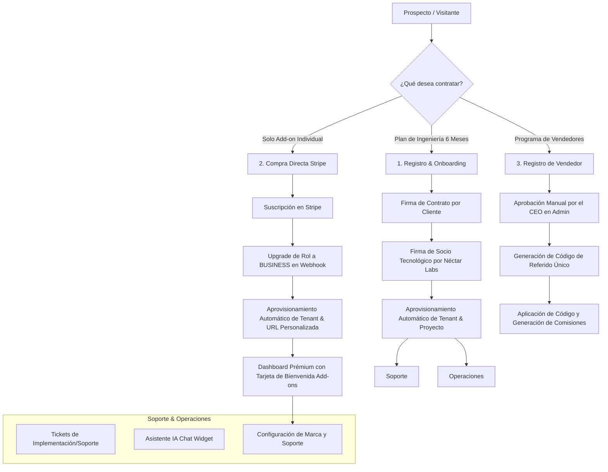

# 🍯 Flujo de Negocio Completo: Néctar Labs (End-to-End)

Este documento detalla el ciclo de vida comercial, logístico, y técnico de **Néctar Labs**, diseñado bajo los estándares más profesionales y la filosofía de desarrollo artesanal prémium.

---

## 🗺️ Mapa General del Flujo de Negocio

El ecosistema opera en torno a tres pilares: **Partners Tecnológicos** (planes de ingeniería), **Suite de Add-ons** (módulos independientes auto-gestionados), y el **Programa de Vendedores / Referidos** (afiliados).

---

## 👥 1. Flujo de Registro y Onboarding (Clientes con Plan)

Este flujo aplica para clientes que deciden contratar un plan de desarrollo de ingeniería de software a 6 meses.

### Registro
- El cliente se registra en la plataforma `/register` seleccionando la opción **Cliente**. El sistema crea la cuenta con el rol `CUSTOMER` temporalmente.

### Onboarding de Partner (Pasos 1 a 4)
1. **Paso 1: Datos de Facturación / Razón Social**: El cliente proporciona su RFC, Razón Social, dirección fiscal y detalles clave.
2. **Paso 2: Selección del Plan**: El cliente elige uno de los planes disponibles (ej. Essential, Growth, Scale) o plan personalizado.
3. **Paso 3: Compromiso de Pago**: Elige su método de pago de preferencia (Stripe o Transferencia Bancaria) y la fecha compromiso de pago mensual.
4. **Paso 4: Firma del Contrato**: Se genera un PDF preliminar y el cliente realiza la firma autógrafa digital. Tras firmar, se inicia una cuenta regresiva de 5 segundos que lo redirige automáticamente al **Dashboard**.

### Firma del Socio Tecnológico (Néctar Labs) y Aprovisionamiento
- En el Dashboard del Administrador, el equipo de Néctar Labs visualiza el contrato en **Contrataciones en Proceso**.
- Una vez validado, el administrador firma digitalmente el contrato mediante el método `dev_sign`.
- **Aprovisionamiento Automático de Infraestructura**:
  - Se genera un **Tenant** para el cliente con un subdominio autogenerado basado en su nombre (ej. `mi-negocio.nectarlabs.dev`).
  - Se genera el **Proyecto** en el Dashboard y se asocian las horas mensuales de diseño y desarrollo correspondientes.
  - Se generan los comprobantes/mensualidades de pago obligatorias de forma independiente para desarrollo y diseño.

---

## ⚡ 2. Flujo de "Solo Add-ons" (Sin Plan ni Contrato de Desarrollo)

Este flujo está diseñado para clientes que no requieren desarrollos a medida ni planes de ingeniería de 6 meses, pero desean utilizar las herramientas públicas de Néctar Labs (ej. Live Chat, Booking Canvas, Newsletter, etc.).

### Adquisición y Pago en Stripe
- El cliente se registra e inicia sesión en la plataforma. Navega al catálogo de **Add-ons** y presiona **Suscribirse**.
- Es redirigido al Checkout de Stripe. Una vez completado el pago de forma exitosa, el webhook de Stripe recibe el evento de confirmación.

### Auto-Aprovisionamiento en Webhook (`backend/apps/shop/views.py`)
- Al procesar el evento `addon_subscription`, el webhook de backend ejecuta las siguientes acciones automáticas en una transacción segura:
  1. **Upgrade de Rol**: Actualiza el rol del usuario a `BUSINESS` (propietario del negocio) si su rol era `CUSTOMER`.
  2. **Contrato Básico**: Crea un contrato básico con `plan = null` e `is_fully_signed = True` de manera automática, sirviendo como registro comercial.
  3. **Auto-Aprovisionamiento de Tenant**: Si el usuario no tiene un tenant activo, genera su subdominio basado en su nombre y crea el **Tenant** en la base de datos (ej. `tunegocio.nectarlabs.dev` o `tunegocio.staging.nectarlabs.dev`).
  4. **Ticket de Soporte de Integración**: Genera automáticamente un ticket de categoría `IMPLEMENTATION` asignado a su nuevo tenant para que los ingenieros de soporte conecten y configuren el módulo.

### Experiencia del Cliente en el Dashboard (`/dashboard`)
- Al volver al dashboard principal tras el pago exitoso:
  - **Sin Alertas de Onboarding**: La alerta de "Finalizar Onboarding" se oculta automáticamente, ya que detecta que cuenta con un contrato firmado activo y de "Solo Add-ons".
  - **Tarjeta de Bienvenida Prémium**: En lugar de mostrar un mensaje de error o una sección vacía de proyectos, se renderiza una tarjeta prémium de bienvenida específica para clientes de Add-ons.
  - **Acceso a Personalización**: Explica claramente que su portal público/subdominio ya está listo y lo invita a personalizar los colores, logotipo, textos del pie de página y el mensaje de bienvenida de su asistente IA ingresando a la sección **Configuración Soporte** del menú lateral.
  - **Políticas de Dominio Personalizado**: Explica que si requiere un dominio propio (ej. `soporte.midominio.com`), puede ponerse en contacto para generar una cotización y contrato de mapeo de dominio (los costos varían según disponibilidad y proveedor).

---

## 🎨 3. Flujo de Cotizador de Proyectos Modulares (A Medida)

Este flujo está diseñado para clientes y prospectos que no desean contratar un plan mensual de socio tecnológico ni add-ons individuales predefinidos, sino que requieren cotizar un proyecto de software a la medida basado en módulos de funcionalidad personalizados.

### 1. Creación de la Cotización por Administración
- El Administrador/CEO puede acceder a la sección **Cotizaciones** en la pestaña de **Control de Negocio** en el Dashboard.
- Utilizando el formulario interactivo prémium de alta de cotizaciones, el administrador puede:
  - Ingresar los datos de contacto del prospecto (Nombre y Email).
  - Definir el nombre del proyecto y alcance general.
  - Seleccionar módulos de funcionalidad estándar predefinidos en la plataforma (ej. Autenticación, E-commerce, Reservaciones) y ajustar dinámicamente sus costos o descripciones individuales.
  - Añadir módulos de software 100% personalizados, especificando el costo de inversión unitario.
  - Estipular el estimado de semanas de entrega del proyecto modular.
  - Guardar la cotización en estado **Borrador (DRAFT)** o **Enviado (SENT)**. El sistema genera de forma asíncrona un archivo PDF formal con la imagen corporativa de Néctar Labs.

### 2. Aprobación y Creación Automática de Contrato
- Una vez que la propuesta comercial es acordada, el Administrador cambia el estado de la cotización a **Aprobado (APPROVED)** en el Dashboard.
- Al activarse esta transición:
  - El sistema verifica si el correo de contacto tiene una cuenta en la plataforma. Si no existe, genera de forma segura una cuenta de invitado con el rol `BUSINESS`. Si ya tiene el rol `CUSTOMER`, lo asciende automáticamente a `BUSINESS`.
  - El sistema genera de forma automática un **Contrato** asociado a esa cotización específica con `is_fully_signed = False` y `signature_base64 = ""` (vacía).
  - El cliente recibe una notificación vía correo electrónico con un enlace directo para revisar y firmar su nuevo contrato.

### 3. Firma Digital por el Cliente
- Al iniciar sesión en el dashboard, el cliente visualiza un banner destacado que indica **"Acción Requerida: Pendiente de tu firma"**.
- Al presionar **"Revisar y Firmar Contrato"**, es redirigido a `/contract/sign/[id]`.
- En esta interfaz, el cliente puede:
  - Visualizar el desglose completo del contrato con los módulos cotizados, el total de inversión y las semanas estimadas de entrega.
  - Rellenar/confirmar sus datos de facturación (Nombre o Razón Social, RFC y Dirección Fiscal).
  - Trazar su firma en el lienzo digital y pulsar **"Firmar Contrato e Iniciar"**.
- El backend registra la firma, actualiza la información fiscal, y genera el PDF parcial (firmado únicamente por el cliente), notificando por correo electrónico al equipo de Néctar Labs.

### 4. Firma del Socio Tecnológico (Néctar Labs) y Aprovisionamiento Final
- El Administrador de Néctar Labs ve el contrato en la sección de **Contratos por Validar** en su dashboard.
- Accede a la pantalla de firma del desarrollador, traza su firma digital y aprueba.
- Al cerrarse el ciclo de firmas (`is_fully_signed = True`):
  - **Aprovisionamiento Automático**: Se genera automáticamente el **Tenant** (subdominio) del cliente y se registra el **Proyecto** en estado **MVP**.
  - **Mensualidades del Proyecto**: Se generan automáticamente dos abonos obligatorios independientes del 50% cada uno:
    1. **Abono 1 (Anticipo):** Correspondiente al 50% del total de la cotización, con fecha de vencimiento inmediata para iniciar con el desarrollo del proyecto.
    2. **Abono 2 (Liquidación):** Correspondiente al 50% restante del total de la cotización, con fecha de vencimiento al cumplir las semanas estimadas de desarrollo desde la fecha de firma.
  - **Copia Certificada**: Ambos firmantes reciben por correo el PDF final certificado.

---

## 💸 4. Programa de Vendedores y Sistema de Referidos

Este programa incentiva a los usuarios a vender los servicios de Néctar Labs a cambio de comisiones recurrentes sumamente atractivas.

### Registro y Aprobación de Vendedores
- Los usuarios interesados se registran en `/register` seleccionando la opción **Vendedor**. El sistema los registra con el rol `SALES`.
- Para evitar fraudes y asegurar el profesionalismo, el perfil del vendedor entra en estado inactivo. El CEO/Administrador de Néctar Labs debe validar sus datos y marcar la casilla `is_approved_seller` en el panel administrativo para habilitarlo.

### Códigos de Referido Únicos
- Una vez aprobado, el sistema le genera de forma automática un código de referido único (ej. `SALES-XYZ`).
- El vendedor cuenta con una interfaz exclusiva con KPIs clave: *Total de Ventas Generadas*, *Mensualidades Cobradas*, *Comisiones Pendientes de Pago*, y *Comisiones Pagadas*.

### Estructura de Comisiones Recurrentes
Las comisiones de los vendedores son sumamente competitivas y se pagan mensualmente por cada pago que sus clientes referidos realicen, rindiendo la siguiente jerarquía por mensualidad:
- **10%** de comisión durante la mensualidad 1 (Adquisición).
- **5%** de comisión durante la mensualidad 2.
- **2%** de comisión recurrente desde la mensualidad 3 hasta la mensualidad 6.

### Aplicación Retroactiva del Código
- Si el cliente olvidó registrar el código de referido del vendedor durante su onboarding, el sistema cuenta con una opción profesional en el dashboard de cliente para **Ingresar Código Retroactivo**.
- El cliente puede ingresar el código antes de realizar el primer pago o durante el transcurso del contrato, actualizando automáticamente las comisiones generadas para el vendedor.

---

## 🛠️ 5. Infraestructura de Soporte Técnico

Todo cliente con un plan o con Add-ons activos tiene acceso a la suite de soporte.

### Centro de Tickets
- Permite abrir solicitudes técnicas clasificadas por Categorías (Soporte Técnico, Facturación, Implementación de Add-on, Bug).
- Notificaciones vía correo electrónico integradas de forma automática al crear el ticket o responder en el hilo de mensajes.

### Asistente IA Integrado (Widget Chat en Tiempo Real)
- **Conectividad por WebSockets**: Cada portal público de cliente (ej. `tunegocio.nectarlabs.dev`) incluye un widget flotante de chat que se conecta directamente al microservicio Node.js `realtime` mediante WebSockets (`wss://[domain]/ws/`).
- **Respuestas en Streaming**: La IA de asistencia procesa las consultas de los usuarios finales y responde en streaming (token por token) usando la API de Groq Cloud sin esperas prolongadas.
- **Acceso Directo a Contexto**: El microservicio realiza consultas en base de datos PostgreSQL para verificar el estado de los tickets, contratos y configuraciones del cliente (tenant) y así proporcionar respuestas 100% personalizadas y con contexto preciso del negocio.
- **Escalamiento Humano**: Si la conversación requiere intervención humana, el sistema permite crear automáticamente un ticket de soporte en la base de datos, notificando al equipo de Néctar Labs.

---

**Néctar Labs** - *Desarrollo de Software Artesanal e Ingeniería de Nivel Mundial.* 🚀
