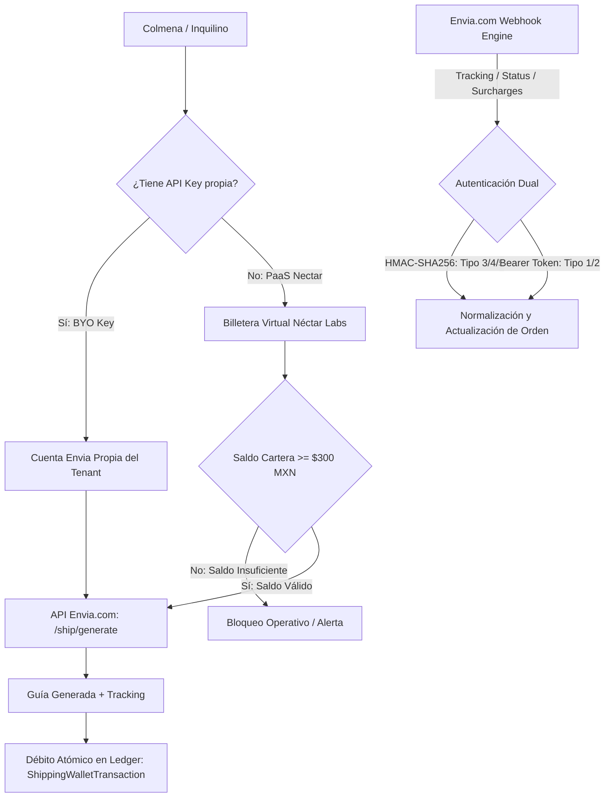
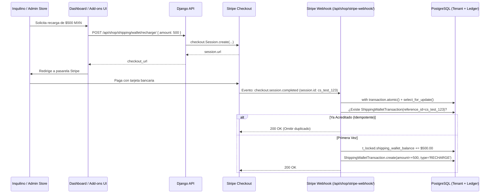

# 📦 Nectar Labs — Guía Integral de Logística Multi-Tenant & Envia.com

Documentación técnica maestra para el aprovisionamiento, operación, auditoría y mantenimiento de la infraestructura de envíos automatizados y billetera de cartera de **Néctar Labs**, integrando **Envia.com API v1**.

---

## 1. Arquitectura del Motor Logístico Multi-Tenant

Néctar Labs ofrece logística como servicio de plataforma (**PaaS**) a través de una arquitectura multi-inquilino desacoplada con dos modalidades operativas:



### Modalidades Operativas
1. **Cuenta Maestra Néctar Labs (PaaS - Por Defecto):**
   - El socio no necesita negociar con transportistas (FedEx, DHL, Paquetexpress, Estafeta).
   - Néctar Labs financia la cuenta corporativa en Envia.com.
   - El inquilino recarga saldo en su billetera virtual (`Tenant.shipping_wallet_balance`).
   - Se cobra el costo real del courier más la comisión de servicio configurada (`Tenant.platform_shipping_fee`, por defecto `$10.00 MXN`).
2. **Bring Your Own Key (BYO Key):**
   - Si el inquilino configura su propia clave (`tenant.shipping_envia_api_key`), las etiquetas se emiten con cargo directo a su cuenta de Envia.com y solo se liquida la comisión de plataforma.

---

## 2. Inventario de Webhooks y Credenciales en Vivo

### Credenciales de API Maestras
Las credenciales maestras deben definirse exclusivamente en los archivos `.env` respectivos (`.env.prod`, `.env.staging`, `.env.local`):
* **Producción:** Variable `ENVIA_PRODUCTION_TOKEN` en `.env.prod`
  - Shipping Base: `https://api.envia.com`
  - Queries Base: `https://queries.envia.com`
  - Geocodes Base: `https://geocodes.envia.com`
* **Sandbox / Staging:** Variable `ENVIA_SANDBOX_TOKEN` en `.env.staging` y `.env.local`
  - Shipping Base: `https://api-test.envia.com`
  - Queries Base: `https://queries.test.envia.com`
  - Geocodes Base: `https://geocodes.envia.com`

### Webhooks Registrados en Envia.com
| Ambiente | ID Webhook | Tipo Evento | URL del Receptor | Variable de Autenticación |
| :--- | :--- | :--- | :--- | :--- |
| **Producción** | `#4786` | `onShipmentStatusUpdate` | `https://nectarlabs.dev/api/shop/shipping/webhooks/envia/` | Configurado en `ENVIA_WEBHOOK_TOKENS` (`.env.prod`) |
| **Producción** | `#4808` | `ecommerceTracking` | `https://nectarlabs.dev/api/shop/shipping/webhooks/ecommerceTracking` | Configurado en `ENVIA_WEBHOOK_TOKENS` (`.env.prod`) |
| **Staging** | `#1057` | `onShipmentStatusUpdate` | `https://staging.nectarlabs.dev/api/shop/shipping/webhooks/envia/` | Configurado en `ENVIA_WEBHOOK_TOKENS` (`.env.staging`) |
| **Staging** | `#1058` | `ecommerceTracking` | `https://staging.nectarlabs.dev/api/shop/shipping/webhooks/ecommerceTracking` | Configurado en `ENVIA_WEBHOOK_TOKENS` (`.env.staging`) |

> [!NOTE]
> **Compatibilidad de Slashes:** El router de URLs de Django soporta de forma nativa tanto la variante con barra final (`/ecommerceTracking/`) como sin barra (`/ecommerceTracking`), previniendo redirecciones HTTP 301 que degraden o pierdan el cuerpo JSON del webhook.

---

## 3. Protocolo de Pruebas en Sandbox sin Consumo de Saldo

Antes de realizar recargas de saldo real en la cuenta corporativa de Producción, todo el ciclo de vida debe verificarse en el entorno de pruebas de Envia.com.

### Ventajas de Sandbox en Envia.com
1. **Cero Gasto Financiero:** Las emisiones de guías en `api-test.envia.com` con transportistas de prueba (como `paquetexpress`) retornan etiquetas PDF reales en AWS S3 sin descontar saldo corporativo.
2. **Generación de PDFs Funcionales:** Permite validar formatos de impresión (4x6 térmica y Carta) y escaneo de códigos de barras.
3. **Simulación Oficial de Webhooks:** Envia ofrece el endpoint `POST /ship/webhooktest/` para disparar eventos de rastreo simulados hacia las URLs registradas.

### Comandos de Diagnóstico Operativo (CLI)

```bash
# 1. Cotizar en Sandbox (Hermosillo -> CDMX con Paquetexpress)
./nectar.sh manage test_envia --env sandbox

# 2. Emitir una guía real de prueba en Sandbox (genera PDF en S3)
./nectar.sh manage test_envia --env sandbox --generate-label

# 3. Disparar un evento de webhook de prueba hacia Staging
./nectar.sh manage test_envia --env sandbox --test-webhook

# 4. Probar webhook contra una URL específica
./nectar.sh manage test_envia --env sandbox --test-webhook --webhook-url https://staging.nectarlabs.dev/api/shop/shipping/webhooks/ecommerceTracking

# 5. Auditar saldos de billetera de todos los inquilinos (valida umbral de $300 MXN)
./nectar.sh manage test_envia --check-balance

# 6. Validar cotización en vivo en Producción (solo cotiza tarifas reales, no emite guía)
./nectar.sh manage test_envia --env production
```

---

## 4. Gestión de Billetera y Recargas de Saldo Multi-Tenant

### A. Políticas Financieras & Reglas de Negocio
* **Saldo Mínimo Operativo (`MIN_SHIPPING_WALLET_BALANCE = $300.00 MXN`):**
  - Aplica de forma unificada tanto para el timbrado fiscal de facturas SAT (CFDI 4.0 vía Facturapi) como para la emisión de guías de envío en Envia.com.
  - Si un inquilino tiene menos de `$300.00 MXN`, el sistema bloquea cotizaciones en checkout y emisión de guías con el mensaje:
    `"Saldo insuficiente en tu Cartera de Envíos. Se requiere un saldo mínimo de $300.00 MXN para cotizar y generar guías."`
* **Monto Mínimo de Recarga:**
  - Cualquier abono a través de Stripe Checkout debe ser de al menos `$300.00 MXN` (validado tanto en `/api/shop/shipping/wallet/recharge/` como en `/api/billing/buy-shipping-funds/`).

### B. Flujo de Recarga con Idempotencia Estricta



---

## 5. Matriz de Errores Silenciosos y Protocolo de Resolución

| Síntoma / Error Silencioso | Causa Raíz | Solución Implementada |
| :--- | :--- | :--- |
| **HTTP 401 en Webhook `/ecommerceTracking`** | Token `#4808` de producción faltaba en la lista blanca de Django. | Se incorporó el token en `ENVIA_WEBHOOK_TOKENS` y soporte para variables dinámicas `ENVIA_WEBHOOK_TOKENS_EXTRA`. |
| **Cobro en tarjeta exitoso pero saldo no reflejado** | `BuyShippingFundsView` enviaba metadata `shipping_wallet_recharge` mientras el webhook solo filtraba `shipping_funds_package`. | `stripe_webhook` ahora procesa ambos metadatos de forma unificada e idéntica. |
| **Doble saldo abonado por reintentos de Stripe** | El webhook no consultaba transacciones previas por `reference_id`. | Verificación atómica en `ShippingWalletTransaction` antes de sumar el saldo. |
| **Webhooks fallidos nunca reintentados** | El log de eventos se guardaba prematuramente como `PROCESSED`. | Se agregó el estado `RECEIVED`. Solo pasa a `PROCESSED` tras ejecución exitosa o `ERROR` ante fallas. |
| **Bloqueo del Event Loop / DB en alta demanda** | `generate_shipping_label` mantenía el lock de base de datos durante la petición HTTP a Envia. | Se ejecuta la llamada HTTP fuera de la transacción atómica; el lock se adquiere únicamente para el ajuste de balance. |
| **Error 400 en Envia: `Malformed UTF-8`** | Caracteres acentuados en colonias o nombres de clientes. | Normalización automática en `_format_address` sustituyendo tildes y caracteres especiales. |

---

## 6. Lista de Verificación para Puesta en Marcha (Go-Live)

- [x] Claves de API configuradas en `.env.prod` y `.env.staging`.
- [x] Cuatro tokens de webhook registrados en `ENVIA_WEBHOOK_TOKENS`.
- [x] Migración de modelo aplicada: `0039_alter_enviawebhookeventlog_status.py`.
- [x] Validación de saldo mínimo fijada en `$300.00 MXN`.
- [x] Emisión de prueba en Sandbox verificada con `test_envia --env sandbox --generate-label`.
- [x] Prueba de webhook en Sandbox validada con `test_envia --env sandbox --test-webhook`.
- [x] Cotización de tarifas en vivo verificada en Producción con `test_envia --env production`.
- [x] Fondear la cuenta corporativa maestra de Envia.com en `https://ship.envia.com` para permitir emisión real de envíos a clientes finales.
