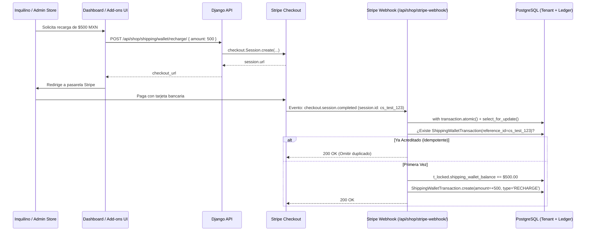

# 📦 Nectar Labs — Guía Integral de Logística Multi-Tenant & Multi-Carrier (Envia.com & Skydropx Pro)

Documentación técnica maestra para el aprovisionamiento, operación, auditoría y mantenimiento de la infraestructura agnóstica de envíos automatizados, multicotizador dinámico y billetera de cartera de **Néctar Labs**, integrando **Envia.com API v1**, **Skydropx Pro API v1/v2** y **Facturapi (CFDI 4.0)**.

---

## 1. Arquitectura del Motor Logístico Multi-Tenant & Multi-Carrier

Néctar Labs ofrece logística agnóstica como servicio de plataforma (**PaaS**) a través de una arquitectura desacoplada escalable a cientos de inquilinos con tres modalidades operativas y soporte multi-carrier simultáneo:

```mermaid
flowchart TD
    Tenant[Inquilino / Tenant Multi-Tenant] --> Router[Logistics Router: Dynamic / Preferred Provider]
    
    Router --> ModeChoice{Estrategia del Tenant}
    ModeChoice -->|DYNAMIC_BEST| DualQuote[Cotización Simultánea Envia + Skydropx]
    ModeChoice -->|ENVIA| EnviaOnly[Proveedor Fijo: Envia.com]
    ModeChoice -->|SKYDROPX| SkydropOnly[Proveedor Fijo: Skydropx Pro]
    
    DualQuote --> BestRank[Ranking por Menor Precio para Comprador]
    
    BestRank --> CheckMode{¿Tiene Credenciales Propias (BYO)?}
    EnviaOnly --> CheckMode
    SkydropOnly --> CheckMode
    
    CheckMode -->|Sí: BYO Key/Secret| CustomAccount[Cuenta Directa del Inquilino]
    CheckMode -->|No: PaaS Nectar Labs| MasterAccount[Cuenta Corporativa Maestra Nectar Labs]
    
    MasterAccount --> CheckBal{Saldo Cartera >= $300 MXN}
    CheckBal -->|No: Saldo Insuficiente| Block[Bloqueo Operativo / Alerta Preventiva]
    CheckBal -->|Sí: Saldo Válido| GenerateLabel[Generación de Guía de Envío]
    CustomAccount --> GenerateLabel
    
    GenerateLabel --> LabelPDF[Guía PDF + Tracking URL]
    LabelPDF --> Deduct[Débito Atómico en Ledger: ShippingWalletTransaction]
    
    GenerateLabel --> InvoiceCheck{auto_invoice_shipping / request_shipping_invoice}
    InvoiceCheck -->|Sí: Opcional| Facturapi[Facturapi SAT CFDI 4.0: Clave 78102200]
    InvoiceCheck -->|No: Por Defecto| SkipInvoice[No Timbrar Automáticamente]
```

### Modalidades Operativas
1. **Cuenta Maestra Néctar Labs (PaaS - Por Defecto):**
   - El socio comercial no necesita negociar ni firmar contratos individuales con transportistas (FedEx, DHL, Paquetexpress, Estafeta, Redpack).
   - Néctar Labs financia las cuentas corporativas maestras en Envia.com y Skydropx Pro.
   - El inquilino recarga saldo en su billetera virtual (`Tenant.shipping_wallet_balance >= $300.00 MXN`).
   - Se cobra el costo real del courier más la comisión de servicio configurada (`Tenant.platform_shipping_fee`, por defecto `$10.00 MXN`).
2. **Bring Your Own Key / Secret (BYO Key):**
   - Si el inquilino configura sus propias claves (`tenant.envia_api_key` o `tenant.skydropx_client_id` / `tenant.skydropx_client_secret`), las etiquetas se emiten con cargo directo a sus cuentas externas y solo se liquida la comisión de plataforma.
3. **Multicotizador Simultáneo Dinámico (`DYNAMIC_BEST`):**
   - Si el tenant tiene configuradas ambas cuentas (o utiliza la cuenta maestra de Néctar Labs), el motor consulta concurrentemente ambos proveedores, normaliza las respuestas en formato `NormalizedRate`, calcula el costo total con margen y presenta al comprador las tarifas ordenadas de menor a mayor precio.

### Arbitraje de Tarifas Validado en Vivo (Prueba Real Hermosillo CP 83000 -> CDMX CP 06600)
Al ejecutar `./nectar.sh test-logistics --provider DYNAMIC_BEST`, el motor unifica y clasifica automáticamente la oferta multi-proveedor:

| Ranking | Proveedor | Courier | Servicio / Nivel | Precio Final Comprador | Tránsito Estimado | Ventaja Competitiva |
| :---: | :---: | :---: | :---: | :---: | :---: | :---: |
| **01** | **ENVIA** | Paquetexpress | `ground_do` | **$24.84 MXN** | 6 días | Tarifa ultra-económica |
| **02** | **ENVIA** | Paquetexpress | `ground_od` | **$24.84 MXN** | 6 días | Alternativa ocurre/domicilio |
| **03** | **ENVIA** | Ups | `saver` | **$24.84 MXN** | 4 días | Courier premium a costo base |
| **04** | **SKYDROPX** | Paquetexpress | `Terrestre (6 días)` | **$166.52 MXN** | 6 días | Mayor cobertura rural |
| **05** | **SKYDROPX** | Estafeta | `Terrestre (6 días)` | **$174.80 MXN** | 6 días | Red nacional densa |
| **06** | **SKYDROPX** | Estafeta | `Express (Día Siguiente)` | **$175.95 MXN** | **1 día** | **Opción Express más barata** |
| **07** | **SKYDROPX** | Paquetexpress | `Terrestre (8 días)` | **$208.15 MXN** | 8 días | Envíos volumétricos |
| **08** | **ENVIA** | Paquetexpress | `ground` | **$231.61 MXN** | 6 días | Servicio tradicional puerta a puerta |
| **09** | **SKYDROPX** | Dhl | `Express (4 días)` | **$285.20 MXN** | 4 días | Confianza de marca internacional |
| **10** | **SKYDROPX** | Ups | `Terrestre (4 días)` | **$312.80 MXN** | 4 días | Garantía empresarial |

> [!TIP]
> **Beneficio Directo de Nectar Labs DYNAMIC_BEST**:
> Si la tienda dependiera exclusivamente de Skydropx, su envío más barato sería de **$166.52 MXN**. Si dependiera exclusivamente de Envia, no tendría opciones express de 1 día a bajo costo como Estafeta a **$175.95 MXN**. `DYNAMIC_BEST` combina lo mejor de ambos mundos, reduciendo carritos abandonados por costo de envío.

---

## 2. Inventario de Credenciales de API y Webhooks

### Variables de Entorno Maestras (.env)
```ini
# Envia.com
ENVIA_ENVIRONMENT=sandbox # 'sandbox' o 'production'
ENVIA_SANDBOX_TOKEN=tu_token_sandbox_envia
ENVIA_PROD_TOKEN=tu_token_produccion_envia
ENVIA_WEBHOOK_TOKENS=["token_1", "token_2"]

# Skydropx Pro
SKYDROPX_ENVIRONMENT=staging # 'staging' o 'production'
SKYDROPX_SANDBOX_API_KEY=tu_client_id_staging
SKYDROPX_SANDBOX_API_SECRET=tu_client_secret_staging
SKYDROPX_PROD_API_KEY=tu_client_id_prod
SKYDROPX_PROD_API_SECRET=tu_client_secret_prod
SKYDROPX_WEBHOOK_SECRET=tu_hmac_webhook_secret_skydropx
```

### Webhooks Registrados
| Proveedor | Evento | URL del Receptor | Método de Autenticación |
| :--- | :--- | :--- | :--- |
| **Envia.com** | `onShipmentStatusUpdate` | `/api/shop/shipping/webhooks/envia/` | Header Bearer / Token |
| **Envia.com** | `ecommerceTracking` | `/api/shop/shipping/webhooks/ecommerceTracking` | Header Bearer / Token |
| **Skydropx Pro** | `shipment.created` / `status_changed` / `surcharge` | `/api/shop/shipping/webhooks/skydropx/` | HMAC-SHA256 (`HTTP_X_SKYDROPX_HMAC_SHA256`) |
| **Skydropx Pro (Alt)** | Formato sin slash | `/api/shop/shipping/webhooks/skydropx` | HMAC-SHA256 (`HTTP_X_SKYDROPX_HMAC_SHA256`) |

> [!NOTE]
> **Compatibilidad de Slashes:** El router de URLs de Django soporta de forma nativa tanto la variante con barra final (`/ecommerceTracking/`) como sin barra (`/ecommerceTracking`), previniendo redirecciones HTTP 301 que degraden o pierdan el cuerpo JSON del webhook.

---

## 3. Protocolo de Pruebas en Sandbox sin Consumo de Saldo

Antes de realizar recargas de saldo real en la cuenta corporativa de Producción, todo el ciclo de vida debe verificarse en el entorno de pruebas de Envia.com.

### Ventajas de Sandbox en Envia.com
1. **Cero Gasto Financiero:** Las emisiones de guías en `api-test.envia.com` con transportistas de prueba (como `paquetexpress`) retornan etiquetas PDF reales en AWS S3 sin descontar saldo corporativo.
2. **Generación de PDFs Funcionales:** Permite validar formatos de impresión (4x6 térmica y Carta) y escaneo de códigos de barras.
3. **Simulación Oficial de Webhooks:** Envia ofrece el endpoint `POST /ship/webhooktest/` para disparar eventos de rastreo simulados hacia las URLs registradas.

### Comandos de Diagnóstico Operativo (CLI)

`nectar.sh` cuenta con comandos nativos que sincronizan en caliente (`sync_logistics_to_container`) el código al contenedor activo (`nectar_backend` o `nectar_backend_staging`) sin necesidad de reconstruir imágenes Docker:

```bash
# === DIAGNÓSTICO UNIFICADO MULTI-CARRIER ===
# 1. Multicotización dinámica en vivo (DYNAMIC_BEST: compara Envia.com y Skydropx Pro en simultáneo)
./nectar.sh test-logistics --provider DYNAMIC_BEST --origin 83000 --dest 06600

# 2. Cotización y diagnóstico específico de Skydropx Pro (Sondeo asíncrono OAuth2 + JSON:API)
./nectar.sh test-logistics --provider SKYDROPX --origin 83000 --dest 06600

# 3. Cotización y diagnóstico específico de Envia.com (Sandbox o Producción)
./nectar.sh test-logistics --provider ENVIA --origin 83000 --dest 06600

# 4. Probar emisión de guía física de prueba en Sandbox (Genera PDF en AWS S3 sin costo financiero)
./nectar.sh test-logistics --provider SKYDROPX --generate-label
./nectar.sh test-logistics --provider ENVIA --generate-label

# 5. Filtrar por transportista específico o evaluar inquilino concreto
./nectar.sh test-logistics --provider DYNAMIC_BEST --carrier paquetexpress
./nectar.sh test-logistics --provider DYNAMIC_BEST --tenant demo-store

# === SHORTCUTS POR AMBIENTE ===
./nectar.sh test-logistics-staging --provider DYNAMIC_BEST
./nectar.sh test-logistics-prod --provider DYNAMIC_BEST

# === COMANDOS ESPECÍFICOS ENVIA.COM ===
# 8. Auditar saldos de billetera de todos los inquilinos (valida umbral de $300 MXN)
./nectar.sh manage test_envia --check-balance
```

---

## 4. Gestión de Billetera y Recargas de Saldo Multi-Tenant

### A. Políticas Financieras & Reglas de Negocio
* **Saldo Mínimo Operativo (`MIN_SHIPPING_WALLET_BALANCE = $300.00 MXN`):**
  - Aplica de forma unificada tanto para el timbrado fiscal de facturas SAT (CFDI 4.0 vía Facturapi) como para la emisión de guías de envío en Envia.com.
  - Si un inquilino tiene menos de `$300.00 MXN`, el sistema bloquea cotizaciones en checkout y emisión de guías con el mensaje:
    `"Saldo insuficiente en tu Cartera de Envíos. Se requiere un saldo mínimo de $300.00 MXN para cotizar y generar guías."`
* **Monto Mínimo de Recarga:**
  - Cualquier abono a través de Stripe Checkout debe ser de al menos `$300.00 MXN` (validado tanto en `/api/shop/shipping/wallet/recharge/` como en `/api/billing/buy-shipping-funds/`).

### B. Flujo de Recarga con Idempotencia Estricta



---

## 5. Matriz de Errores Silenciosos y Protocolo de Resolución

| Síntoma / Error Silencioso | Causa Raíz | Solución Implementada |
| :--- | :--- | :--- |
| **HTTP 401 en Webhook `/ecommerceTracking`** | Token `#4808` de producción faltaba en la lista blanca de Django. | Se incorporó el token en `ENVIA_WEBHOOK_TOKENS` y soporte para variables dinámicas `ENVIA_WEBHOOK_TOKENS_EXTRA`. |
| **Cobro en tarjeta exitoso pero saldo no reflejado** | `BuyShippingFundsView` enviaba metadata `shipping_wallet_recharge` mientras el webhook solo filtraba `shipping_funds_package`. | `stripe_webhook` ahora procesa ambos metadatos de forma unificada e idéntica. |
| **Doble saldo abonado por reintentos de Stripe** | El webhook no consultaba transacciones previas por `reference_id`. | Verificación atómica en `ShippingWalletTransaction` antes de sumar el saldo. |
| **Webhooks fallidos nunca reintentados** | El log de eventos se guardaba prematuramente como `PROCESSED`. | Se agregó el estado `RECEIVED`. Solo pasa a `PROCESSED` tras ejecución exitosa o `ERROR` ante fallas. |
| **Bloqueo del Event Loop / DB en alta demanda** | `generate_shipping_label` mantenía el lock de base de datos durante la petición HTTP a Envia. | Se ejecuta la llamada HTTP fuera de la transacción atómica; el lock se adquiere únicamente para el ajuste de balance. |
| **Error 400 en Envia: `Malformed UTF-8`** | Caracteres acentuados en colonias o nombres de clientes. | Normalización automática en `_format_address` sustituyendo tildes y caracteres especiales. |
| **HTTP 422 en Skydropx Pro: `address_from incompleto`** | Skydropx Pro exige división territorial mexicana estricta. | `_format_skydropx_address` autogenera `area_level1` (Estado), `area_level2` (Municipio) y `area_level3` (Colonia). |
| **0 tarifas en Skydropx Pro tras HTTP 200** | Las paqueterías cotizan en background (`is_completed: false`). | Sondeo asíncrono progresivo en `GET /quotations/{id}` hasta `is_completed: true` y extracción en `data.attributes.rates`. |
| **Falla en `deliveryEstimate` de Envia.com** | El API devolvió un string de rango de días en lugar de diccionario. | Parser defensivo con soporte para rangos numéricos, enteros y fechas ISO. |
| **Nombre de Courier como "Courier" genérico** | Skydropx Pro desacopla metadatos del transportista en `relationships`. | Extracción automática a través de `carrier_map` derivado del bloque JSON:API `included`. |

---

## 6. Lista de Verificación para Puesta en Marcha (Go-Live)

- [x] Claves de API configuradas en `.env.prod` y `.env.staging` (Envia.com y Skydropx Pro).
- [x] Cuatro tokens de webhook registrados en `ENVIA_WEBHOOK_TOKENS`.
- [x] Migración de modelo aplicada: `0039_alter_enviawebhookeventlog_status.py`.
- [x] Validación de saldo mínimo fijada en `$300.00 MXN`.
- [x] Emisión de prueba en Sandbox verificada con `test_envia --env sandbox --generate-label`.
- [x] Prueba de webhook en Sandbox validada con `test_envia --env sandbox --test-webhook`.
- [x] Cotización Skydropx Pro validada en Staging vía `./nectar.sh test-logistics --provider SKYDROPX`.
- [x] Multicotización dinámica en vivo verificada con `./nectar.sh test-logistics --provider DYNAMIC_BEST`.
- [x] Fondear la cuenta corporativa maestra de Envia.com (`https://ship.envia.com`) y Skydropx Pro para despachos en producción.
