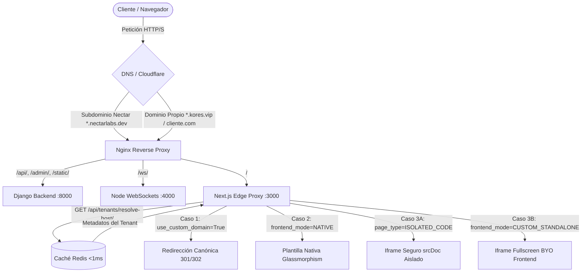

# 🐝 Nectar Labs — Guía Integral de Arquitectura & Configuración Multi-Tenant

Documento técnico maestro para el aprovisionamiento, escalabilidad y operación del ecosistema multi-inquilino en **Local, Staging y Producción**, diseñado bajo la filosofía **Zero-Touch (Cero Deploys y Cero Ediciones en Nginx)**.

---

## 1. Visión General & Flujo de Tráfico Perimetral

Nectar Labs opera como una plataforma SaaS multi-tenant donde coexisten cientos de colmenas de socios. El tráfico fluye a través de una arquitectura desacoplada de 3 niveles:



---

## 2. Los 3 Escenarios de Tenants

### 🏆 Escenario 1: Tenant con Dominio Personalizado Propio (Custom Domain)
* **Casos de Uso:** Socios de marca blanca o tiendas independientes (ej. `kores.vip`, `staging.kores.vip`, `tiendachic.com`).
* **Configuración en Base de Datos (`Tenant`):**
  ```python
  tenant.use_custom_domain = True
  tenant.custom_domain = "kores.vip" # Dominio canónico
  tenant.frontend_mode = "CUSTOM_STANDALONE" # O "NATIVE"
  tenant.custom_frontend_url = "https://staging.kores.vip" # Si es un microservicio autónomo
  ```
* **Comportamiento en Runtime:**
  - Si un usuario entra por el subdominio de Nectar Labs (ej. `kores.nectarlabs.dev` o `kores.staging.nectarlabs.dev`), Nginx y Next.js lo redirigen canónicamente mediante **HTTP 301/302** hacia su dominio propio.
  - Los enlaces en la Landing (`PartnersShowcase`) y Directorio (`/stores`) dirigen directamente a su dominio personalizado (`staging.kores.vip` en staging y `kores.vip` en prod).
  - **CORS Dinámico:** Django autoriza automáticamente el origen CORS de su dominio consultando Redis en tiempo real.

---

### 🎨 Escenario 2: Tenant en Subdominio con Plantilla Nativa (Nectar Core)
* **Casos de Uso:** Clientes que utilizan el motor integral de comercio electrónico de Nectar Labs (ej. `sushilo.nectarlabs.dev`).
* **Configuración en Base de Datos (`Tenant`):**
  ```python
  tenant.subdomain = "sushilo"
  tenant.use_custom_domain = False
  tenant.frontend_mode = "NATIVE"
  tenant.theme_color = "#C68A1E" # Personalización de marca
  tenant.accent_color = "#E0A93B"
  ```
* **Comportamiento en Runtime:**
  - El Edge Proxy de Next.js (`proxy.ts`) detecta el subdominio y reescribe internamente la URL hacia `/tenants/sushilo`.
  - Se renderiza la plantilla Glassmorphism nativa de Nectar Labs con:
    - Catálogo dinámico y carrito de compras.
    - Pasarela de pago Stripe conectada a las credenciales del inquilino.
    - Módulo de Autofacturación SAT CFDI 4.0 (`/autofactura`) con Facturapi.
    - Integración de envíos y rastreo de paquetería vía Envia.com.
    - Widget de soporte y chat en tiempo real con WebSockets.

---

### 🚀 Escenario 3: Tenant en Subdominio con Experiencia Personalizada (Sin Pagar Dominio)
Para clientes que no adquieren un dominio propio y desean permanecer en `https://cliente.nectarlabs.dev`, pero no quieren la plantilla estándar:

#### Subcaso 3A: Código Aislado 100% Standalone (`ISOLATED_CODE`)
* **Configuración en Base de Datos (`TenantPage`):**
  ```python
  page = TenantPage.objects.create(
      tenant=tenant,
      slug="home",
      page_type=TenantPage.PageType.ISOLATED_CODE,
      is_homepage=True,
      is_standalone_isolated=True,
      custom_html="<!DOCTYPE html><html>...</html>"
  )
  ```
* **Aislamiento de Estilos:**
  - Next.js renderiza el contenido dentro de un elemento `<iframe srcDoc={custom_html} sandbox="allow-scripts allow-forms allow-same-origin allow-popups" />`.
  - **Garantía Técnica:** Cero colisión de estilos entre las clases globales de Tailwind CSS de Nectar Labs y el CSS del cliente.

#### Subcaso 3B: Microfrontend / BYO Frontend (`CUSTOM_STANDALONE`)
* **Configuración en Base de Datos (`Tenant`):**
  ```python
  tenant.frontend_mode = "CUSTOM_STANDALONE"
  tenant.custom_frontend_url = "https://mi-tienda.vercel.app" # O contenedor interno Docker
  ```
* **Comportamiento en Runtime:**
  - Next.js renderiza el portal dentro de un iframe fullscreen responsivo.
  - Incluye una barra superior retráctil con enlace directo *"Abrir en ventana completa ↗"* para sortear restricciones de `X-Frame-Options` si el sitio externo no permite embebido directo.
  - El backend de Django habilita CORS para `https://mi-tienda.vercel.app` de forma instantánea.

---

## 3. Guía de Aprovisionamiento Paso a Paso (Zero-Touch)

### Método A: Vía Dashboard Web (Recomendado)
1. Iniciar sesión como Administrador o Dueño del Tenant en `https://staging.nectarlabs.dev/login`.
2. Acceder al módulo **Configuración de Colmena** (`/dashboard/tenant-settings`).
3. Ajustar los parámetros según el escenario requerido:
   - **Subdominio:** Identificador único (ej. `mimarca`).
   - **Modo Frontend:** Seleccionar *Nativa (Glassmorphism)* o *Personalizada (BYO / Proxy)*.
   - **Dominio Personalizado:** Activar casilla y colocar `mimarca.com`.
   - **URL de Frontend Personalizado:** Si se usa microfrontend externo (ej. `https://mimarca.vercel.app`).
4. Hacer clic en **Guardar Cambios**. La caché de Redis se invalida automáticamente. El tenant queda activo de inmediato.

---

### Método B: Vía Consola / Comandos Django

#### 1. Aprovisionar nuevo tenant estándar (Escenario 2):
```bash
docker exec -it nectar_backend_staging python manage.py provision_tenant \
    --slug "sushilo" \
    --name "Sushilo Roll Express" \
    --email "contacto@sushilo.com" \
    --mode "NATIVE"
```

#### 2. Cambiar modo a Standalone o asignar URL externa (Escenario 3B):
```bash
docker exec -it nectar_backend_staging python manage.py set_frontend_mode \
    --slug "sushilo" \
    --mode "CUSTOM_STANDALONE" \
    --custom-url "https://sushilo-app.vercel.app"
```

#### 3. Configurar dominio personalizado (Escenario 1):
```bash
docker exec -it nectar_backend_staging python manage.py shell -c "
from apps.tenants.models import Tenant
from apps.tenants.utils import invalidate_tenant_cache
t = Tenant.objects.get(subdomain='sushilo')
t.use_custom_domain = True
t.custom_domain = 'sushiloroll.com'
t.save()
invalidate_tenant_cache(t)
print('✓ Dominio personalizado asignado con éxito.')
"
```

---

## 4. Configuración DNS del Cliente (Self-Service)

Cuando un cliente usa su propio dominio (Escenario 1), solo debe configurar sus registros DNS en su registrador (Cloudflare, GoDaddy, Namecheap, etc.):

| Tipo | Host / Nombre | Valor / Destino | TTL |
| :--- | :--- | :--- | :--- |
| **CNAME** | `@` (o `www`) | `ingress.nectarlabs.dev` | Automático |
| **A** (Alternativa) | `@` | `185.218.86.25` *(IP del VPS)* | Automático |

> **Nota sobre Cloudflare:** Para dominios en Cloudflare, se recomienda activar el proxy (nube naranja ☁️) para aprovechar la terminación SSL y protección DDoS de borde de forma gratuita.

---

## 5. API de Resolución Ultrarrápida (`resolve-host`)

Para desacoplar Nginx y permitir que microservicios o Edge Proxies resuelvan qué inquilino atiende cada dominio:

* **Endpoint:** `GET /api/tenants/resolve-host/?host=<hostname>`
* **Autenticación:** Pública (AllowAny).
* **Rendimiento:** Caché en memoria Redis (<1ms).

### Ejemplo de Solicitud:
```bash
curl -s "https://staging.nectarlabs.dev/api/tenants/resolve-host/?host=staging.kores.vip"
```

### Respuesta JSON:
```json
{
  "id": "c7a8b3d1-9f2e-4e8a-b1c3-d5e7f9a2b4c6",
  "subdomain": "kores",
  "name": "Kōres Premium Hair Ties",
  "frontend_mode": "CUSTOM_STANDALONE",
  "use_custom_domain": true,
  "custom_domain": "kores.vip",
  "custom_frontend_url": "https://staging.kores.vip",
  "has_isolated_code": false,
  "theme_color": "#1B2E24",
  "accent_color": "#C68A1E",
  "logo_url": "https://staging.kores.vip/logo.png"
}
```

---

## 6. Comandos de Diagnóstico y Mantenimiento

### 1. Verificar Redirección Canónica de Nginx:
```bash
# Probar que el alias de staging redirige limpiamente al dominio canónico
curl -I -H "Host: kores.staging.nectarlabs.dev" http://localhost/
# Debe responder HTTP 302 hacia https://staging.kores.vip/
```

### 2. Comprobar la Resolución en Backend:
```bash
docker exec -it nectar_backend_staging curl -i "http://localhost:8000/api/tenants/resolve-host/?host=staging.kores.vip"
```

### 3. Listar Todos los Tenants y sus Modos en la Base de Datos:
```bash
docker exec -it nectar_backend_staging python manage.py shell -c "
from apps.tenants.models import Tenant
for t in Tenant.objects.all():
    print(f'[{t.subdomain}] Mode: {t.frontend_mode} | Custom Domain: {t.custom_domain} (Active: {t.use_custom_domain}) | URL: {t.custom_frontend_url}')
"
```

### 4. Limpiar y Forzar Reconstrucción de Caché en Redis:
```bash
docker exec -it nectar_backend_staging python manage.py shell -c "
from django.core.cache import cache
cache.clear()
print('✓ Caché de Redis invalidada exitosamente.')
"
```

---

## 6. Motor Logístico Multi-Tenant (Envia.com PaaS)

Cada inquilino cuenta con una cartera virtual unificada para facturación SAT y emisión de guías de paquetería con Envia.com.

* **Guía Operativa Detallada:** Consulte [LOGISTICS_ENVIA_GUIDE.md](file:///home/saulvillecruz/proyectos/repositorios/Nectar-Labs/LOGISTICS_ENVIA_GUIDE.md).
* **Saldo Mínimo Requerido:** `$300.00 MXN` en `Tenant.shipping_wallet_balance`.
* **Diagnóstico Operativo:**
  ```bash
  # Diagnóstico completo en Sandbox con prueba de webhook
  ./nectar.sh manage test_envia --env sandbox --test-webhook
  
  # Auditoría de saldos de todos los inquilinos
  ./nectar.sh manage test_envia --check-balance
  ```
