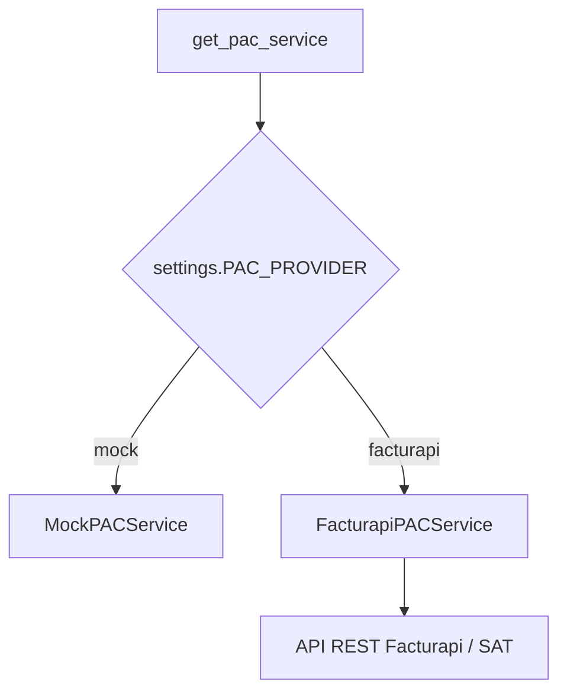
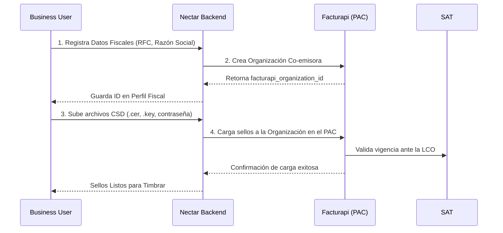

# Guía de Integración con Proveedor Autorizado de Certificación (PAC) - Néctar Labs

Esta guía detalla el diseño técnico, las variables de entorno y los flujos necesarios para transicionar del **Mock PAC** (simulado) a un **PAC Real** autorizado por el SAT (a través de la integración nativa con **Facturapi**) para la emisión de facturas CFDI 4.0.

---

## 🏗️ 1. Arquitectura de Facturación en Néctar Labs

El sistema implementa un patrón de diseño estratégico que separa la lógica del negocio de facturación del proveedor específico mediante la clase abstracta `PACServiceBase` en [services.py](file:///c:/Users/Agent/OneDrive/Documents/proyects/nectarlabs-main/backend/apps/billing/services.py).

Actualmente hay dos implementaciones disponibles:
1. **`MockPACService`**: Simula timbrados y cancelaciones para pruebas locales y CI/CD sin consumir créditos ni conectar al SAT.
2. **`FacturapiPACService`**: Conexión real con la API REST de Facturapi para crear contribuyentes, subir sellos CSD y timbrar facturas oficiales.



---

## 🔑 2. Requisitos Previos en el SAT y Facturapi

Para operar en producción (timbrado real):
1. **Certificado de Sello Digital (CSD):**
   - El cliente/negocio debe tramitar ante el SAT sus archivos de sello CSD (`.cer` y `.key`), junto con su contraseña.
   - *Nota:* La firma electrónica (e.firma / FIEL) **no** sirve para timbrar facturas directamente; debe ser un CSD de tipo factura.
2. **Cuenta en Facturapi:**
   - Registrarse en [Facturapi](https://www.facturapi.com).
   - Obtener la **API Key de Sandbox** (para pruebas de desarrollo) y la **API Key Live** (para producción real).

---

## ⚙️ 3. Configuración en Néctar Labs

### Paso 1: Configurar Variables de Entorno
Edita tu archivo `.env` o las variables de entorno en Staging/Producción en el VPS añadiendo:

```ini
# Proveedor de facturación ('mock' o 'facturapi')
PAC_PROVIDER=facturapi

# Llave secreta provista por Facturapi (comienza con 'sk_test_' o 'sk_live_')
PAC_API_KEY=sk_test_tu_llave_secreta_aqui
```

### Paso 2: Validación en settings.py
Verifica que en el archivo `backend/config/settings.py` se lean correctamente estas propiedades:

```python
PAC_PROVIDER = env("PAC_PROVIDER", default="mock")
PAC_API_KEY = env("PAC_API_KEY", default="")
```

El inyector de dependencia `get_pac_service()` leerá automáticamente estos valores del archivo de configuración para instanciar la clase correcta.

---

## 🔄 4. Flujo de Trabajo para un Negocio (BUSINESS)

Cuando un negocio se registra en el ecosistema y activa la facturación:



### Gestión del Retraso de Sincronización de Sellos (LCO)
> [!IMPORTANT]
> Cuando se tramita o sube un CSD nuevo en el SAT, la Lista de Contribuyentes Obligados (LCO) puede tardar **de 24 a 72 horas** en sincronizarse.
>
> La integración en `FacturapiPACService` captura este caso y eleva una excepción del tipo `LCOSyncError`. Tu frontend debe mostrar un aviso amigable en lugar de un error de sistema si el timbrado falla debido a este retraso.

---

## 🛠️ 5. Flujos de Código Clave

### A. Emisión y Timbrado de Factura
El método `create_invoice` del servicio se encarga de estructurar el JSON, redondear decimales para prevenir errores de cálculo del SAT y descargar localmente las representaciones XML y PDF timbradas:

```python
from apps.billing.services import get_pac_service, PACError, LCOSyncError

pac = get_pac_service()

try:
    resultado = pac.create_invoice(
        invoice=invoice_instance,
        tax_profile=business_tax_profile,
        customer_info={
            "razon_social": "Cliente SA de CV",
            "rfc": "XAXX010101000",
            "regimen_fiscal": "601",
            "codigo_postal": "01000",
            "email": "cliente@example.com"
        },
        items=[
            {
                "quantity": 1,
                "unit_price": 25000.00,
                "description": "Desarrollo de Software Modular"
            }
        ]
    )
    
    # El resultado contiene los archivos listos para guardar en DB
    invoice_instance.facturapi_invoice_id = resultado["facturapi_invoice_id"]
    invoice_instance.uuid_sat = resultado["uuid_sat"]
    invoice_instance.xml_file = resultado["xml_file"]
    invoice_instance.pdf_file = resultado["pdf_file"]
    invoice_instance.status = "PAID"
    invoice_instance.save()

except LCOSyncError as e:
    # Manejar retraso de sellos del SAT
    logger.warning(f"Sello pendiente de sincronización: {e}")
except PACError as e:
    # Errores generales de timbrado
    logger.error(f"Error de timbrado: {e}")
```

### B. Cancelación de CFDI
Para cancelar una factura (la cual puede requerir la aprobación del cliente final si supera el monto límite del SAT), Facturapi retorna el estado de la cancelación:

```python
try:
    estado_cancelacion = pac.cancel_invoice(invoice_instance)
    if estado_cancelacion == "CANCELLED":
        invoice_instance.status = "CANCELLED"
    else:
        # Requiere aceptación del receptor
        invoice_instance.status = "CANCEL_REQUESTED"
    invoice_instance.save()
except PACError as e:
    logger.error(f"Error al cancelar factura: {e}")
```

---

## 🚦 6. Verificación en Sandbox

Para comprobar que tu conexión funciona:
1. Configura `PAC_PROVIDER=facturapi` y `PAC_API_KEY` con una llave de prueba (`sk_test_...`).
2. Usa el RFC genérico de pruebas de Facturapi para simular la organización y clientes.
3. Intenta generar una factura desde el Dashboard y verifica que se descargue el archivo `.xml` firmado y el `.pdf` con el sello digital de prueba.
