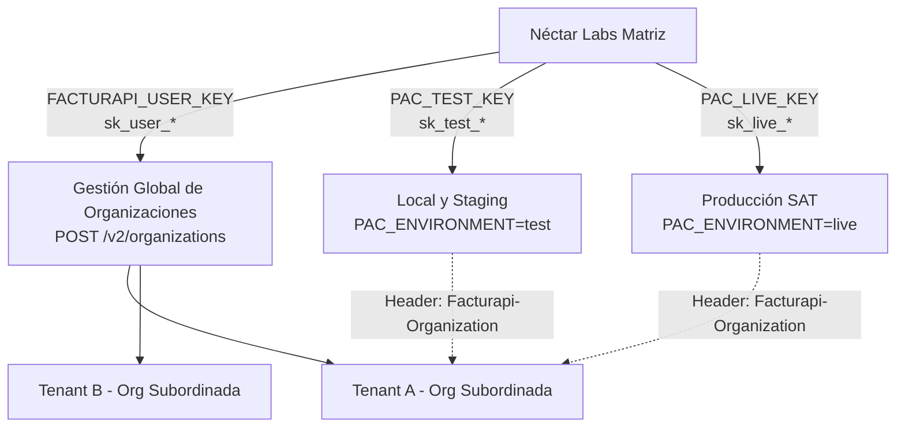

# Guía de Integración con Facturapi v2 y Multi-Tenant — Néctar Labs

Esta guía detalla la arquitectura técnica, las llaves de acceso, los endpoints y los flujos necesarios para operar la facturación CFDI 4.0 con **Facturapi v2** en **Local**, **Staging** y **Producción** utilizando el sistema de organizaciones subordinadas y la cartera de créditos de timbres fiscales de los tenants.

---

## 🏗️ 1. Arquitectura de Tres Llaves (Parent Account & Subordinated Orgs)

Néctar Labs opera como una plataforma SaaS multi-tenant mediante tres llaves maestras provistas por Facturapi:


```mermaid
graph TD
    A[Néctar Labs Matriz] -->|FACTURAPI_USER_KEY<br/>sk_user_*| B[Gestión Global de Organizaciones<br/>POST /v2/organizations]
    A -->|PAC_TEST_KEY<br/>sk_test_*| C[Local y Staging<br/>PAC_ENVIRONMENT=test]
    A -->|PAC_LIVE_KEY<br/>sk_live_*| D[Producción SAT<br/>PAC_ENVIRONMENT=live]
    B --> E[Tenant A - Org Subordinada]
    B --> F[Tenant B - Org Subordinada]
    C -.->|Header: Facturapi-Organization| E
    D -.->|Header: Facturapi-Organization| E
```

### Definición y Propósito de las Llaves:
1. **User Key (`FACTURAPI_USER_KEY` = `sk_user_*`)**:
   - Llave de cuenta de usuario padre.
   - **Obligatoria** para crear (`POST /v2/organizations`) y configurar datos fiscales (`PUT /v2/organizations/{id}/legal`) de organizaciones subordinadas.
2. **Test Key (`PAC_TEST_KEY` = `sk_test_*`)**:
   - Utilizada en ambientes `local` y `staging`.
   - Permite timbrar con RFC genérico del SAT (`AAA010101AAA`) y certificados de prueba sin validez fiscal ni costo de timbres.
3. **Live Key (`PAC_LIVE_KEY` = `sk_live_*`)**:
   - Utilizada en ambiente `production` (`PAC_ENVIRONMENT=live`).
   - Timbra ante el SAT en tiempo real utilizando los Certificados de Sello Digital (CSD) reales del negocio.
   - Cada CFDI emitido descuenta un timbre de la cartera del tenant en Néctar Labs.

---

## ⚙️ 2. Variables de Entorno

Configuradas en `.env.local`, `.env.staging` y `.env.prod`:

```ini
# Proveedor PAC
PAC_PROVIDER=facturapi
PAC_ENVIRONMENT=test            # 'test' en local/staging, 'live' en prod

# Llaves Facturapi
FACTURAPI_USER_KEY=sk_user_tu_llave_usuario_facturapi
PAC_TEST_KEY=sk_test_tu_llave_pruebas_facturapi
PAC_LIVE_KEY=sk_live_tu_llave_produccion_facturapi

# Webhook Secret para validación de firma HMAC SHA-256
FACTURAPI_WEBHOOK_SECRET=tu_webhook_secret_aqui
```

---

## 🔒 3. Seguridad de Sellos Digitales (CSD) y LCO

1. **Cero Almacenamiento Local de Llaves Privadas:**
   - Los archivos `.cer`, `.key` y la contraseña se transmiten en memoria (`multipart/form-data`) directamente a los HSM de Facturapi en `/v2/organizations/{id}/certificate`.
   - Django **nunca** guarda los archivos CSD en disco ni en base de datos.
2. **Eliminación Segura:**
   - `DELETE /api/billing/csd-status/` invoca `DELETE /v2/organizations/{id}/certificate` en Facturapi.
3. **Manejo de Lista de Contribuyentes Obligados (LCO):**
   - Cuando un negocio tramita o renueva su CSD en el SAT, la LCO puede demorar de **24 a 72 horas** en activarse.
   - El sistema captura este fallo como `LCOSyncError` y marca la factura en estado `LCO_SYNC_PENDING` sin fallar el proceso de compra. Un worker en background reintenta el timbrado periódicamente.

---

## 📊 4. Cartera de Timbres y Prevención de Concurrencia

Para evitar deducciones dobles o inconsistencias ante múltiples peticiones simultáneas:
1. **Transacciones Atómicas con Bloqueo de Fila:**
   - `Tenant.atomic_deduct_stamp()` y `Tenant.atomic_refund_stamp()` usan `select_for_update()`.
2. **Registro Inmutable de Auditoría:**
   - Cada movimiento genera un registro en el modelo `StampTransaction` con `transaction_type` (`CONSUMPTION`, `RECHARGE`, `REFUND`, `EXPIRED`, `BONUS`), `stamps_before` y `stamps_after`.
3. **Protección Webhook:**
   - Si la vista síncrona dedujo el timbre (`stamp_deducted = True`), el webhook `invoice.created` no vuelve a descontar.
   - En caso de evento `invoice.failed`, si el timbre fue deducido previamente, el webhook ejecuta un reembolso automático (`atomic_refund_stamp`).

---

## 🚀 5. Catálogo Completo de Endpoints

### Facturación CFDI
- `GET /api/billing/invoices/`: Listado de facturas del tenant.
- `POST /api/billing/invoices/issue-tenant-to-client/`: Emisión de factura a cliente final.
- `POST /api/billing/invoices/issue-parent-to-tenant/`: Factura administrativa de Néctar Labs al inquilino.
- `POST /api/billing/invoices/{id}/cancel/`: Solicitud de cancelación ante el SAT con motivo (`01`, `02`, `03`, `04`).
- `POST /api/billing/invoices/{id}/retry/`: Reintento de timbrado para facturas fallidas o pendientes LCO.
- `GET /api/billing/invoices/{id}/zip/`: Descarga directa del archivo comprimido ZIP con XML y PDF oficiales.
- `POST /api/billing/invoices/{id}/send-email/`: Envío de factura por correo mediante la infraestructura de Facturapi.
- `POST /api/billing/invoices/{id}/issue-credit-note/`: Emisión de nota de crédito (CFDI Tipo E) relacionada a la factura.

### CSD y Perfil Fiscal
- `GET, POST /api/billing/tax-profile/`: Configuración de datos fiscales y creación de organización en Facturapi.
- `POST /api/billing/upload-csd/`: Subida de certificados `.cer` y `.key` con contraseña en memoria.
- `GET, DELETE /api/billing/csd-status/`: Consulta de vigencia/número de serie y eliminación de CSD.

### Catálogos y E-Receipts
- `GET, POST /api/billing/facturapi-customers/`: CRUD de clientes fiscales del tenant.
- `GET, POST /api/billing/facturapi-products/`: CRUD de productos/conceptos fiscales.
- `GET, POST /api/billing/facturapi-receipts/`: Emisión de notas de venta digitales (sin timbrar ante SAT).
- `POST /api/billing/facturapi-receipts/{receipt_id}/invoice/`: Facturación individual de una nota de venta existente.
- `POST /api/billing/facturapi-receipts/global-invoice/`: Emisión de factura global consolidada por periodo.
- `GET, POST /api/billing/facturapi-retentions/`: Emisión y consulta de CFDI de retenciones e información de pagos.

### Cartera y Auditoría
- `GET /api/billing/stamp-transactions/`: Historial inmutable de auditoría del balance de timbres.
- `POST /api/billing/buy-stamps/`: Checkout Stripe para recarga de paquetes de 50, 100 o 500 timbres.

---

## 🧪 6. Diagnóstico y Pruebas con CLI (nectar.sh)

Para validar la conectividad y las credenciales desde la terminal:

```bash
# Diagnóstico completo (User Key, Test Key y Live Key)
./nectar.sh test-facturapi --check-all

# Diagnóstico de ambiente actual (según PAC_ENVIRONMENT)
./nectar.sh test-facturapi

# Verificación de credenciales Live SAT
./nectar.sh test-facturapi-live
```
