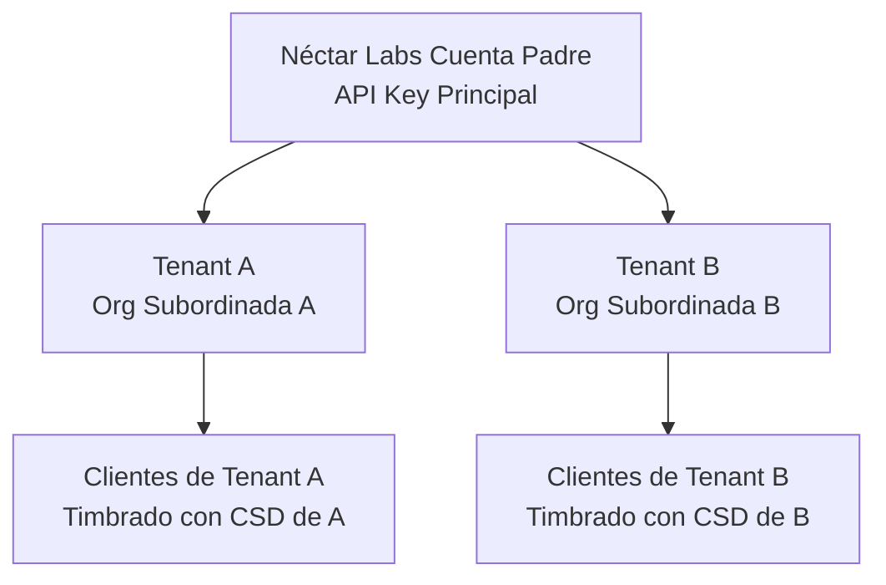
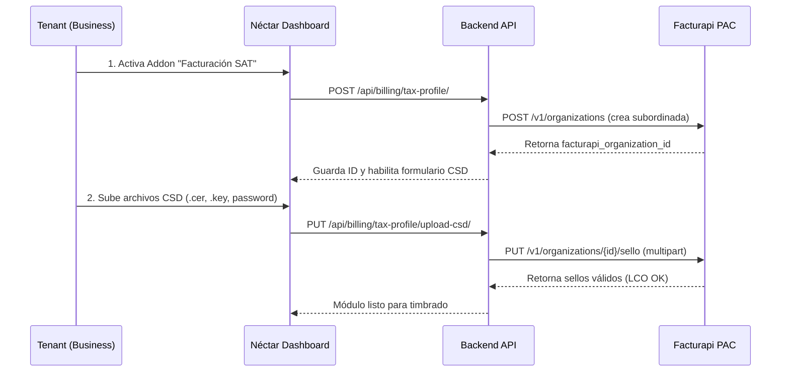

# Monetización y Operación de Facturación Marca Blanca (SaaS White-Label Invoicing) - Néctar Labs

Esta guía detalla cómo opera la arquitectura multi-tenant de Néctar Labs para permitir que tus **tenants (dueños de negocios)** emitan facturas timbradas por el SAT a sus propios clientes directamente desde tu plataforma, y cómo puedes empaquetar, vender y monetizar este servicio para generar un flujo de ingresos recurrente de alto margen.

---

## 💰 1. El Modelo de Negocio (Monetización)

El timbrado de CFDI ante el SAT tiene un costo por volumen. Al usar Facturapi como tu PAC principal, tú (Néctar Labs) eres el "propietario de la cuenta padre" y puedes comprar timbres en volumen a un costo muy bajo (ej. **$0.15 MXN a $0.30 MXN** por timbre).

Puedes revender este servicio a tus tenants bajo tres modelos de monetización altamente rentables:

### Modelo A: Add-on Mensual Fijo (Recomendado)
- Vendes el módulo de facturación como un Add-on en tu tienda de módulos por **$299 MXN / mes**.
- Este add-on incluye un límite (ej. 100 facturas al mes).
- Si consumen más, pagan una tarifa por factura excedente de **$1.50 MXN** (Margen del ~400%).

### Modelo B: Paquetes de Créditos (Timbres)
- Vendes paquetes de facturas prepagadas en tu dashboard:
  - Paquete 100 timbres: **$199 MXN** ($1.99 por factura)
  - Paquete 500 timbres: **$699 MXN** ($1.39 por factura)
  - Paquete 1000 timbres: **$1,199 MXN** ($1.19 por factura)

### Modelo C: Integrado en Planes Premium
- Incluyes facturación ilimitada o de alto volumen en tus planes de suscripción más altos (ej. Plan Premium de **$79 USD / mes**).

---

## 🏗️ 2. Arquitectura de Organizaciones Subordinadas (Multi-tenant)

La API de Facturapi está diseñada específicamente para plataformas SaaS a través del concepto de **Organizaciones Subordinadas**.

Toda la lógica de timbrado implementada en [services.py](file:///c:/Users/Agent/OneDrive/Documents/proyects/nectarlabs-main/backend/apps/billing/services.py) ya está preparada para este modelo:



### Reglas de Operación Segura:
1. **Custodia de Sellos (Seguridad):** Los archivos CSD (`.cer` y `.key`) y su contraseña no se almacenan en la base de datos de tu servidor. Se envían inmediatamente a los HSM (Hardware Security Modules) certificados del PAC mediante HTTPS. Esto te exime de cualquier responsabilidad legal sobre la custodia de claves criptográficas de terceros.
2. **Aislamiento de Consumos:** Cada factura emitida lleva el header `"Facturapi-Organization": tax_profile.facturapi_organization_id`. Esto asegura que el SAT reconozca al Tenant como el emisor legal, mientras que tú pagas el consumo de API consolidado en tu cuenta padre de Facturapi.

---

## 🔄 3. Flujo Técnico de Integración en el SaaS

Para que un tenant pueda facturar desde su portal de marca blanca, el sistema sigue este flujo:



---

## 🛠️ 4. Guía de Configuración en Producción

### Paso 1: Configurar Add-on de Facturación
En tu base de datos de producción (usando `seed_addons.py` o Django Admin), debes registrar el módulo de facturación:
- **Nombre:** Facturación Electrónica SAT México
- **Slug:** `mexico-invoicing`
- **Descripción:** Emite facturas CFDI 4.0 oficiales del SAT a tus clientes de manera automatizada.

### Paso 2: Restricciones de Acceso en las Vistas (Gating)
Para asegurar que los dueños de negocios solo puedan ver/crear facturas si tienen el add-on activo, utiliza la clase de permiso `HasAddOnPermission` en tus vistas del backend de facturación:

```python
from rest_framework import viewsets, permissions
from apps.tenants.permissions import HasAddOnPermission

class InvoiceViewSet(viewsets.ModelViewSet):
    permission_classes = [permissions.IsAuthenticated, HasAddOnPermission]
    addon_slug = 'mexico-invoicing'
    
    # La vista se bloqueará con 403 si el tenant no tiene el plan o addon firmado
```

### Paso 3: Monitoreo de Consumo y Timbres
En tu panel de administración principal, puedes consultar la cantidad de timbres emitidos por cada organización para facturarles los excedentes.
Facturapi provee un webhook para monitorear el consumo de créditos. Puedes añadir un endpoint en tu servidor para escuchar el evento `invoice.created` y debitar un timbre del balance de créditos del tenant en tu base de datos.

---

## 🚀 5. Ventajas Competitivas para Néctar Labs
- **Propuesta de Valor Única (SaaS Completo):** Los clientes prefieren una plataforma centralizada que cubra agendamiento, cobros y facturación fiscal en una sola pantalla.
- **Flujo de Ingresos Pasivo:** Cada factura emitida a través de tu plataforma te genera un margen financiero directo.
- **Efecto Red:** Una vez que un negocio configura sus sellos CSD y se acostumbra a facturar automáticamente en tu portal, la tasa de cancelación de su suscripción (churn rate) baja a casi 0% debido a la complejidad de migrar sus sellos y registros a otro software.
