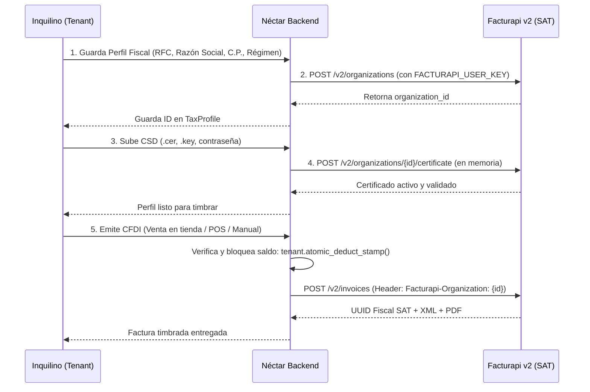

# Monetización y Operación de Facturación Marca Blanca (SaaS White-Label Invoicing) — Néctar Labs

Esta guía detalla cómo opera la arquitectura multi-tenant de Néctar Labs para permitir que los **inquilinos (negocios)** emitan facturas timbradas por el SAT a sus clientes finales directamente desde su portal, y cómo se gestiona y monetiza la cartera de créditos de timbres.

---

## 💰 1. Modelo de Negocio y Monetización de Timbres

Al utilizar Facturapi con una cuenta matriz centralizada, Néctar Labs adquiere paquetes de timbres fiscales por volumen con costo marginal (**$0.15 a $0.30 MXN** por timbre). Néctar Labs revende el servicio a través de:

1. **Add-on Mensual con Cuota de Timbres Incluidos:**
   - Add-on `facturacion-cfdi` en la tienda de módulos por suscripción mensual.
   - Incluye una cuota mensual de timbres de cortesía (ej. 50 timbres/mes).
2. **Paquetes de Recarga Prepagada (Stripe Checkout):**
   - Paquete de 50 timbres: **$75.00 MXN** ($1.50 / timbre).
   - Paquete de 100 timbres: **$150.00 MXN** ($1.50 / timbre).
   - Paquete de 500 timbres: **$750.00 MXN** ($1.50 / timbre).
3. **Planes de Ecosistema Digital:**
   - Los contratos comerciales y planes embajadores cuentan con bolsas de timbres especiales asignadas desde la consola administrativa.

---

## 🏗️ 2. Arquitectura de Organizaciones Subordinadas

Cada tenant que activa el add-on cuenta con una **Organización Subordinada** en Facturapi administrada desde la cuenta de Néctar Labs:

```mermaid
sequenceDiagram
    participant T as Inquilino (Tenant)
    participant N as Néctar Backend
    participant F as Facturapi v2 (SAT)

    T->>N: 1. Guarda Perfil Fiscal (RFC, Razón Social, C.P., Régimen)
    N->>F: 2. POST /v2/organizations (con FACTURAPI_USER_KEY)
    F-->>N: Retorna organization_id
    N-->>T: Guarda ID en TaxProfile

    T->>N: 3. Sube CSD (.cer, .key, contraseña)
    N->>F: 4. POST /v2/organizations/{id}/certificate (en memoria)
    F-->>N: Certificado activo y validado
    N-->>T: Perfil listo para timbrar

    T->>N: 5. Emite CFDI (Venta en tienda / POS / Manual)
    N->>N: Verifica y bloquea saldo: tenant.atomic_deduct_stamp()
    N->>F: POST /v2/invoices (Header: Facturapi-Organization: {id})
    F-->>N: UUID Fiscal SAT + XML + PDF
    N-->>T: Factura timbrada entregada
```

---

## 🛡️ 3. Reglas de Operación y Mitigación de Riesgos

1. **Blindaje de Concurrencia:**
   - El consumo de créditos utiliza `select_for_update()` a nivel de base de datos para evitar saldos negativos bajo tráfico concurrente.
2. **Trazabilidad Total:**
   - La tabla inmutable `StampTransaction` audita cada consumo, compra, reembolso y bonificación con marcas de tiempo y referencias de folio fiscal.
3. **Manejo de Errores y Reembolsos:**
   - Si Facturapi o el SAT rechazan el timbrado (`PACError`), la deducción no se efectúa.
   - Si una factura se cancela o falla asíncronamente en el webhook (`invoice.failed`), el sistema reintegra automáticamente el timbre con `Tenant.atomic_refund_stamp()`.
4. **Protección CSD:**
   - Los archivos criptográficos nunca se escriben en el almacenamiento del servidor de Néctar Labs. Facturapi asume el estándar de seguridad bancaria y almacenamiento HSM.
