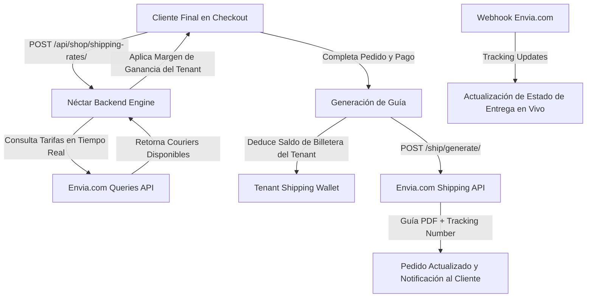

# Guía de Integración de Envíos (Envia.com) — Néctar Labs

Esta guía detalla la arquitectura, configuración, endpoints y mejores prácticas operativas del sistema de envíos y logística multi-tenant de Néctar Labs impulsado por **Envia.com**.

---

## 🏗️ 1. Arquitectura de Logística Multi-Tenant

Néctar Labs proporciona logística automatizada para todas las tiendas en línea de los inquilinos, permitiendo cotizaciones en tiempo real con múltiples paqueterías (Paquetexpress, FedEx, DHL, Estafeta, Redpack, etc.), generación de guías en PDF e integración con la billetera de saldo prepagado:



---

## ⚙️ 2. Variables de Entorno y Configuración

Configuradas en `.env.local`, `.env.staging` y `.env.prod`:

```ini
# Ambiente Envia.com ('sandbox' o 'production')
ENVIA_ENVIRONMENT=sandbox

# Tokens Maestros de Plataforma
ENVIA_SANDBOX_TOKEN=tu_token_sandbox_envia
ENVIA_PROD_TOKEN=tu_token_produccion_envia

# Endpoints Base de Envia.com
ENVIA_SHIPPING_API_URL=https://api.envia.com
ENVIA_QUERIES_API_URL=https://queries.envia.com
ENVIA_GEOCODES_API_URL=https://geocodes.envia.com
```

---

## 💼 3. Modos de Operación por Tenant

Cada inquilino puede operar la logística de dos maneras:
1. **Cuenta Maestra de Néctar Labs con Billetera (Default):**
   - El inquilino recarga saldo a su billetera de envíos mediante Stripe (`POST /api/shop/shipping/wallet/recharge/`).
   - Las guías se emiten con la cuenta maestra de Néctar Labs.
   - El saldo se debita automáticamente de forma atómica (`select_for_update()`) en cada compra.
2. **Llave Propia del Tenant (BYOK - Bring Your Own Key):**
   - El inquilino introduce su propio token de Envia.com en la configuración de la tienda.
   - El costo de las guías se factura directamente a la cuenta de Envia.com del inquilino.

### Margen de Ganancia en Envíos:
Los inquilinos pueden configurar un porcentaje de margen adicional sobre el costo real del envío en el portal de administración:
```python
# Cálculo en apps/shop/shipping.py:
precio_final = tarifa_base * (1 + (tenant.shipping_markup_percentage / 100))
```

---

## 📦 4. Catálogo de Endpoints de Envíos

### Cotización y Validación
- `POST /api/shop/shipping-rates/`: Cotización en tiempo real basada en código postal de origen (tienda) y destino (cliente).
- `POST /api/shop/shipping/geocodes/zipcode/`: Validación de código postal, colonia, municipio y estado con la API Geocodes de Envia.com.
- `GET /api/shop/order-status/?order_id={id}`: Consulta de estatus de rastreo del paquete y enlace de descarga de la guía en PDF.

### Billetera de Envíos (Tenant)
- `POST /api/shop/shipping/wallet/recharge/`: Genera una sesión de Stripe Checkout para recargar saldo de envíos.
- `GET /api/shop/shipping/wallet/history/`: Historial inmutable de movimientos de la billetera (recargas, débitos por guía, reembolsos).

### Webhooks de Rastreo
- `POST /api/shop/shipping/webhooks/envia/`
- `POST /api/shop/shipping/webhooks/ecommerceTracking/`:
  - Recibe eventos de cambio de estatus de la paquetería (recolectado, en tránsito, en reparto, entregado, retrasado, devuelto).
  - Actualiza el modelo `Order` y emite eventos en tiempo real mediante WebSockets / Server-Sent Events.

---

## 🛠️ 5. Diagnóstico y Pruebas con CLI (nectar.sh)

Comandos rápidos para validar la integración de envíos desde la terminal:

```bash
# Diagnóstico general de Envia.com (verifica URLs y tokens)
./nectar.sh test-envia

# Cotización forzando ambiente Sandbox
./nectar.sh test-envia --env sandbox

# Generación de guía de prueba en Sandbox (crea PDF y número de rastreo)
./nectar.sh test-envia-label

# Cotización con paquetería específica en Producción
./nectar.sh test-envia-prod --carrier paquetexpress
```
